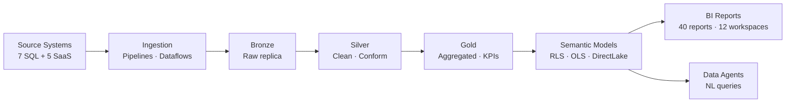

# Executive Summary

## Organisation Profile

**Mid-Kansas Cooperative (MKC)** is an agricultural co-operative headquartered in Moundridge, Kansas. MKC serves grain producers, feed customers, and agronomy clients across central Kansas through five business lines:

- **Grain** — origination, storage, merchandising
- **Feed & Agronomy** — crop inputs, application services
- **Energy** — fuel and lubricants
- **Administration & HR** — finance, HR, compliance
- **Digital & Producer Services** — producer portal, precision ag

## The Data Challenge

MKC's current data environment has grown organically across multiple business systems with no unified platform:

- **7 on-premises SQL Server databases** (MKCGP, MWFGP, Agtrax_BI, HAVEN, AgVend, ITAPPS, DynamicsGPWarehouse) accessed independently by report developers
- **5 SaaS/API sources** (AgVantage, AgWorld, Dynamics CRM, SharePoint, external card controls) with ad-hoc integration patterns
- **40 Power BI reports** across 12 workspaces with **34 dataflows** — many duplicating the same source connections with inconsistent transformations
- **No medallion architecture** — reports query source systems directly, meaning business definitions (e.g. "grain sale") are defined differently per report
- **No row-level or object-level security** consistently enforced across reports
- **No data lineage or catalog** — tracing where a number comes from requires manual investigation

## The Proposed Solution

MKC's new data platform is built on **Microsoft Fabric** with a **Bronze → Silver → Gold → Semantic Model** medallion architecture, using **OneLake** (Azure Data Lake Gen2) as the single storage layer storing all data as **Delta Parquet** — an open format that prevents vendor lock-in.

## Expected Outcomes

| Outcome | Current State | Target State |
|---------|--------------|-------------|
| Single version of truth | Each report defines metrics independently | Shared Gold + Semantic Model layer |
| Report refresh performance | Import mode: 30–60 min refresh | DirectLake: sub-second, always current |
| Data quality | No systematic checks | Silver-layer schema enforcement + DQ rules |
| Security | Workspace-level only | RLS + OLS per semantic model, Entra groups |
| AI readiness | None | Data Agents in each workspace; Azure OpenAI |
| Vendor risk | Mixed formats, hard to migrate | Delta Parquet on ADLS Gen2 — readable by any engine |
| Governance | No lineage, no catalog | Microsoft Purview catalog, lineage, sensitivity labels |

## Investment Summary

| Scenario | Monthly Cost | Users | F-SKU |
|----------|-------------|-------|-------|
| Small (pilot) | ~$1,257 | ≤ 30 | F8 + F4 |
| **Medium (recommended)** | **~$4,536** | **≤ 150** | **F32 + F8** |
| Large (enterprise) | ~$7,484 | 500+ | F64 + F16 |

> See [FinOps → Deployment Scenarios](../07_finops/scenarios.md) for full cost breakdown.
