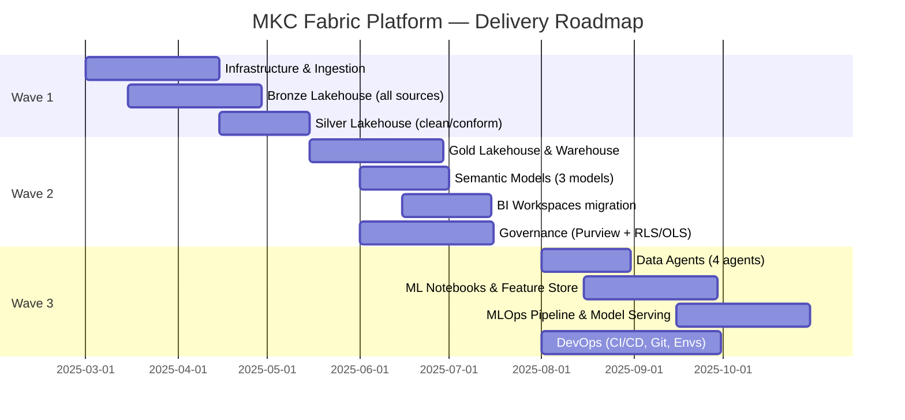

# Delivery Roadmap

The platform is delivered in three waves, each building on the previous. Each wave delivers working, production-grade value before the next begins.

## Wave Overview

---

## Wave 1 — Foundation (Months 1–3)

**Goal:** Stable, governed raw + clean data in OneLake. No end-user impact yet.

| Deliverable | Detail | Owner |
|-------------|--------|-------|
| Fabric capacity provisioned | F32 (Prod) + F8 (Dev) | Infrastructure |
| On-Premises Data Gateway | Installed on mkc-sqlcall; standard mode | Data Engineering |
| Bronze Lakehouse | All 7 SQL databases + 5 SaaS sources ingested as Delta Parquet | Data Engineering |
| Fabric Pipelines | Hourly CDC for MKCGP (rowversion watermark), nightly full for CARDTROLSVR-01 | Data Engineering |
| Dataflow Gen2 migration | Existing 34 Power Query dataflows migrated to Fabric Dataflow Gen2 | Data Engineering |
| Silver Lakehouse | PySpark MERGE INTO notebooks for all sources; MKCGP + MWFGP unioned | Data Engineering |
| Schema enforcement | Column types, null checks, referential integrity at Silver ingest | Data Engineering |
| Key Vault | All SQL credentials stored as Key Vault secrets; no plaintext passwords | Security |
| Dev/Test/Prod workspaces | Naming convention established; Git integration configured | DevOps |

**Exit criteria:** All source data flowing to Bronze within 24 hours of source change; Silver passes DQ checks on first load.

---

## Wave 2 — Analytics (Months 4–6)

**Goal:** End-users on Fabric-native Power BI with consistent metrics and security.

| Deliverable | Detail | Owner |
|-------------|--------|-------|
| Gold Lakehouse | Spark SQL aggregation notebooks; KPI and fact tables | Data Engineering |
| Fabric Warehouse | External tables pointing at Gold Delta files; T-SQL views for BI tools | Data Engineering |
| Semantic Models | Sales, Financial, Operations — DirectLake mode from Gold | Analytics |
| RLS implementation | DAX `USERPRINCIPALNAME()` filters per Entra group | Analytics / Security |
| OLS implementation | Margin, Salary, Credit Limit columns hidden by role | Analytics / Security |
| BI workspace migration | All 40 reports re-pointed to Fabric semantic models | Analytics |
| Microsoft Purview | Auto-scan of OneLake; lineage tracking; sensitivity labels | Governance |
| Entra ID groups | sg-pbi-sales-*, sg-pbi-finance-*, sg-pbi-ops-* groups created | IT/Security |

**Exit criteria:** All 40 reports loading from Fabric semantic models; RLS tested for all Entra groups; Purview lineage visible for all Gold tables.

---

## Wave 3 — AI & MLOps (Months 7–12)

**Goal:** Natural-language querying, predictive models, and full DevOps automation.

| Deliverable | Detail | Owner |
|-------------|--------|-------|
| Azure OpenAI provisioning | GPT-4o + text-embedding-3-large; Private Endpoint; Managed Identity | Infrastructure / Security |
| APIM LLM Gateway | Rate limits (50K tokens/min/workspace); audit log → Log Analytics | Infrastructure |
| Data Agents (4) | Operational, Analytics, Financial, Domain — one per BI workspace group | AI Engineering |
| Feature Store | Gold Delta feature tables for ML models | Data Science |
| ML Notebooks | Yield prediction, demand forecasting, producer churn | Data Science |
| MLflow integration | Experiment tracking, model registry, versioning | Data Science |
| Model Serving | Fabric Function App endpoints for inference | Data Science |
| GitHub Actions CI/CD | Notebook lint, DQ test, workspace promotion pipeline | DevOps |
| Observability | Azure Monitor dashboards; Capacity Metrics app; APIM token dashboard | Operations |

**Exit criteria:** All 4 Data Agents answering NL questions with correct DAX; at least 1 ML model in production serving predictions; CI/CD pipeline promoting workspace items end-to-end.

---

## Risk Register

| Risk | Probability | Impact | Mitigation |
|------|------------|--------|-----------|
| On-prem gateway connectivity | Medium | High | Test gateway throughput in Wave 1 before Silver build; provision failover gateway |
| Power Query dataflow migration complexity | Medium | Medium | Reuse existing M code in Dataflow Gen2; test parity report-by-report |
| DirectLake compatibility | Low | High | Gold Delta tables must use V1 schema format; validate with DirectLake analyser tool |
| Azure OpenAI capacity limits | Low | Medium | Provision PTU for production agents at Wave 3 kickoff |
| Change management (user adoption) | High | Medium | Early stakeholder demos at end of Wave 2; lunch-and-learn for Data Agents |
