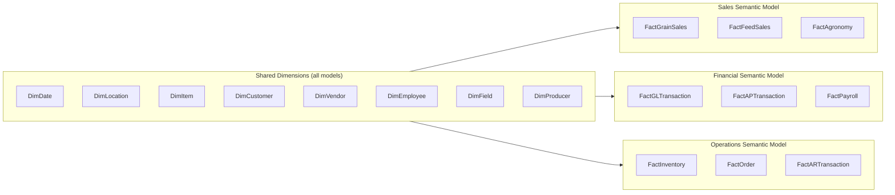

# Star Schema Design

The Gold layer implements a **star schema** with 8 shared dimension tables and 9 fact tables distributed across three semantic models.

## Shared Dimensions

These dimension tables are loaded once in Gold and referenced by all three semantic models:

| Dimension | Source DB | Source Table / API | Description | Key Columns |
|-----------|----------|--------------------|-------------|-------------|
| `DimDate` | Calculated | — | Standard date/calendar with fiscal periods | `date_key`, `full_date`, `fiscal_period`, `fiscal_year`, `calendar_week` |
| `DimLocation` | MKCGP | `LocationsMaster` | Site / elevator / location hierarchy | `location_key`, `location_name`, `region`, `division`, `city`, `state` |
| `DimItem` | MKCGP | `IV00101` | Item / product / commodity master | `item_key`, `item_code`, `description`, `commodity_type`, `unit_of_measure` |
| `DimCustomer` | MKCGP | `RM00101` | Customer account master | `customer_key`, `customer_id`, `name`, `region`, `credit_limit` |
| `DimVendor` | MKCGP | `SY01400` | Vendor / supplier master | `vendor_key`, `vendor_id`, `name`, `payment_terms` |
| `DimEmployee` | HAVEN | HR tables | Employee master, department, role | `employee_key`, `employee_id`, `name`, `department`, `role`, `salary_grade` |
| `DimField` | AgWorld | Field API | Agricultural field geometry + attributes | `field_key`, `field_id`, `producer_key`, `acres`, `crop_year`, `geometry` |
| `DimProducer` | AgVantage / AgWorld | Producer API | Grower / producer master | `producer_key`, `producer_id`, `name`, `location_key`, `acres_enrolled` |

## Fact Tables

| Fact Table | Source DB(s) | Semantic Model | Grain | Description |
|------------|-------------|----------------|-------|-------------|
| `FactGrainSales` | Agtrax_BI + MKCGP | Sales | Transaction line | Grain purchase and sale transactions — quantity (bushels), price, location |
| `FactFeedSales` | MKCGP | Sales | Transaction line | Feed and agricultural supply sales |
| `FactAgronomy` | AgVantage + AgWorld | Sales | Field application | Field services, crop application records per producer/field |
| `FactGLTransaction` | MKCGP GL | Financial | Journal line | General ledger entries — debit/credit, cost centre, account |
| `FactAPTransaction` | MKCGP AP | Financial | Invoice line | Accounts payable invoices and payments |
| `FactPayroll` | HAVEN | Financial | Pay run line | Payroll disbursements by employee, pay period, department |
| `FactInventory` | MKCGP (`IV30300`) | Operations | Movement | Inventory receipts, adjustments, transfers |
| `FactOrder` | AgVend | Operations | Order line | Vendor / purchase orders — quantity, price, delivery date |
| `FactARTransaction` | MKCGP AR | Operations | Invoice line | Accounts receivable invoices, payments, aging |

## Semantic Model Allocation



## Key Measure Examples

=== "Sales"
    ```dax
    -- Total Grain Revenue
    [Total Grain Revenue] :=
    CALCULATE(
        SUMX(FactGrainSales, FactGrainSales[quantity_bushels] * FactGrainSales[price_per_bushel]),
        FactGrainSales[transaction_type] = "Sale"
    )

    -- Grain Margin %
    [Grain Margin %] :=
    DIVIDE(
        [Total Grain Revenue] - [Total Grain Cost],
        [Total Grain Revenue]
    )
    ```

=== "Financial"
    ```dax
    -- GL Balance by Cost Center
    [GL Balance] :=
    SUMX(FactGLTransaction,
        IF(FactGLTransaction[debit_credit] = "D",
           FactGLTransaction[amount],
          -FactGLTransaction[amount])
    )

    -- AP Overdue Amount
    [AP Overdue] :=
    CALCULATE(
        SUM(FactAPTransaction[invoice_amount]),
        FactAPTransaction[due_date] < TODAY(),
        FactAPTransaction[status] = "Open"
    )
    ```

=== "Operations"
    ```dax
    -- Inventory on Hand
    [Inventory On Hand] :=
    CALCULATE(
        SUM(FactInventory[quantity_change]),
        FactInventory[movement_type] IN {"Receipt", "Transfer In", "Adjustment"}
    ) -
    CALCULATE(
        SUM(FactInventory[quantity_change]),
        FactInventory[movement_type] IN {"Issue", "Transfer Out"}
    )

    -- AR Aging (60+ days)
    [AR 60+ Days] :=
    CALCULATE(
        SUM(FactARTransaction[open_amount]),
        FactARTransaction[days_outstanding] >= 60,
        FactARTransaction[status] = "Open"
    )
    ```

!!! info "Conformed Dimensions"
    All three semantic models share the same `DimDate`, `DimLocation`, `DimCustomer` etc. from Gold. This means cross-model analysis (e.g., Sales + Financial margin) is possible in composite models without data inconsistencies.
