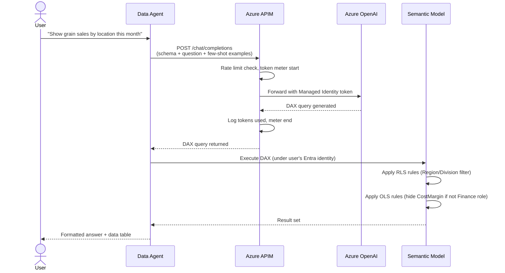

# Fabric Data Agents

## What Are Fabric Data Agents?

Fabric Data Agents are **natural-language query interfaces** scoped to specific semantic models within their workspace. Each agent:

1. Accepts a plain-English question from a user
2. Sends the question (with semantic model schema context) to Azure OpenAI via APIM
3. Receives a DAX or SQL query generated by GPT-4o
4. Executes that query against the semantic model **under the user's own Entra identity**
5. Returns a formatted answer — RLS/OLS rules are automatically enforced

!!! info "Key Security Property"
    Because the DAX/SQL is executed under the **user's own identity**, all Row-Level Security and Object-Level Security rules apply automatically. A sales rep asking "What are total margins by region?" will only see regions they have access to — the agent cannot bypass RLS.

## Agent → Workspace → Semantic Model Mapping

| Agent | Workspace Group | Semantic Model(s) | Example NL Questions |
|-------|----------------|-------------------|---------------------|
| **Data Agent (Operational)** | Sales, OMS, Operations | Sales | *"What were grain sales in Q3 by location?"* |
| **Data Agent (Analytics)** | Executive, Data Portal | Sales + Financial + Operations | *"Show margin trend vs budget by division this fiscal year"* |
| **Data Agent (Financial)** | Financial Reporting, Financial Processing | Financial | *"Which AP invoices are overdue by cost center?"* |
| **Data Agent (Domain)** | Administration, Producer Ag, HR, Digital Transformation | Financial + Operations | *"What fields are enrolled per producer this planting season?"* |

## Query Flow



## System Prompt Structure

Each agent is pre-configured with a system prompt containing:

```
You are a data analyst assistant for MKC (Mid-Kansas Cooperative).
You have access to the Sales semantic model which contains:

TABLES:
- FactGrainSales (transaction_id, date_key, location_key, item_key,
                  customer_key, quantity_bushels, price_per_bushel, amount_usd)
- DimDate (date_key, full_date, fiscal_period, fiscal_year, calendar_month_name)
- DimLocation (location_key, location_name, region, division)
- DimItem (item_key, description, commodity_type)
- DimCustomer (customer_key, name, region)

MEASURES (pre-defined):
- [Total Grain Revenue], [Total Grain Bushels], [Grain Margin %]

RULES:
- Always use DAX, never SQL for this semantic model
- Use CALCULATE() with FILTER() for date ranges
- Use USERPRINCIPALNAME() for user-specific queries
- Return at most 100 rows in result tables

FEW-SHOT EXAMPLES:
Q: What were grain sales last month?
A: EVALUATE SUMMARIZECOLUMNS(DimDate[fiscal_period], "Sales", [Total Grain Revenue])
```

## Configuring a Data Agent in Fabric

1. In the target BI workspace, create a new **Data Agent** item (Fabric AI item type)
2. Connect it to the workspace's semantic model
3. Configure the system prompt with table schema and few-shot DAX examples
4. Set the Azure OpenAI endpoint to the APIM gateway URL
5. Test with sample questions; iterate on few-shot examples
6. Publish to workspace — all workspace members can now query via the agent

## Monitoring Agent Usage

All agent queries flow through APIM, which logs to Log Analytics:

```kusto
// Top 10 questions by frequency
AzureDiagnostics
| where ResourceType == "APIMANAGEMENT" and OperationName == "chat/completions"
| extend WorkspaceId = tostring(parse_json(tostring(requestBody_s))["workspace"])
| extend Question = tostring(parse_json(tostring(requestBody_s))["messages"][1]["content"])
| summarize QueryCount = count() by Question, WorkspaceId
| top 10 by QueryCount desc
```

```kusto
// Token usage by workspace (for chargeback)
AzureDiagnostics
| where ResourceType == "APIMANAGEMENT"
| extend Tokens = toint(parse_json(tostring(responseBody_s))["usage"]["total_tokens"])
| extend WorkspaceId = tostring(requestBody_headers.x_workspace_id)
| summarize TotalTokens = sum(Tokens), QueryCount = count() by WorkspaceId, bin(TimeGenerated, 1d)
| order by TimeGenerated desc
```
