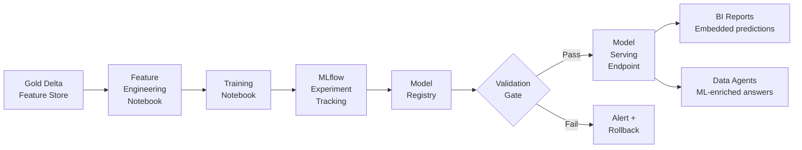

# MLOps Pipeline

## Pipeline Overview



## Components

### 1. Feature Engineering Notebooks

Feature engineering reads from Gold Delta tables and writes processed features back to the Gold layer as a **Feature Store** (see [Feature Store](feature-store.md)):

```python
# feature_engineering/grain_price_features.py
from pyspark.sql import functions as F, Window

df = spark.read.format("delta").load(gold_grain_sales_path)

# Rolling 7-day average price per commodity
window = Window.partitionBy("item_key").orderBy("date_key").rowsBetween(-6, 0)
df = df.withColumn("price_7d_avg", F.avg("price_per_bushel").over(window))

# Price vs 7-day average ratio (momentum signal)
df = df.withColumn("price_momentum", F.col("price_per_bushel") / F.col("price_7d_avg"))

# Write to feature store
df.write.format("delta").mode("overwrite").option("overwriteSchema", "true") \
    .save(feature_store_grain_price_path)
```

### 2. Training Notebooks with MLflow

```python
import mlflow
import mlflow.sklearn
from sklearn.ensemble import GradientBoostingRegressor
from sklearn.model_selection import train_test_split
from sklearn.metrics import mean_absolute_error

mlflow.set_experiment("grain-demand-forecast")

with mlflow.start_run(run_name="GBM-v1"):
    # Load features
    df = spark.read.format("delta").load(feature_store_path).toPandas()
    X = df[["price_7d_avg", "price_momentum", "season_index", "location_encoded"]]
    y = df["next_7d_volume"]

    X_train, X_test, y_train, y_test = train_test_split(X, y, test_size=0.2, random_state=42)

    model = GradientBoostingRegressor(n_estimators=200, max_depth=5, learning_rate=0.05)
    model.fit(X_train, y_train)

    mae = mean_absolute_error(y_test, model.predict(X_test))

    # Log parameters and metrics
    mlflow.log_params({"n_estimators": 200, "max_depth": 5, "learning_rate": 0.05})
    mlflow.log_metric("mae", mae)
    mlflow.log_metric("mae_pct", mae / y_test.mean())

    # Register model if MAE is within threshold
    if mae < ACCEPTABLE_MAE_THRESHOLD:
        mlflow.sklearn.log_model(model, "grain_demand_model",
                                 registered_model_name="mkc-grain-demand-forecast")
        print(f"Model registered. MAE: {mae:.2f} bushels")
    else:
        print(f"Model failed quality gate. MAE: {mae:.2f} exceeds {ACCEPTABLE_MAE_THRESHOLD}")
```

### 3. Model Registry

MLflow Model Registry (hosted on Fabric's integrated MLflow instance) tracks:

| Stage | Description | Promotion Criteria |
|-------|-------------|-------------------|
| **None** | Raw experiment run | Automatic |
| **Staging** | Candidate for production | MAE within threshold, feature drift < 5% |
| **Production** | Live serving | Stakeholder sign-off + A/B test vs current |
| **Archived** | Superseded by newer version | Automatic on new Production deployment |

### 4. Model Serving

Production models are served via **Fabric Function Apps** (serverless REST endpoints):

```python
# model_serving/grain_demand_endpoint.py
import mlflow.sklearn
import json

model = mlflow.sklearn.load_model("models:/mkc-grain-demand-forecast/Production")

def handler(request):
    body = json.loads(request.get_body())
    features = [[
        body["price_7d_avg"],
        body["price_momentum"],
        body["season_index"],
        body["location_encoded"]
    ]]
    prediction = model.predict(features)[0]
    return {"predicted_volume_bushels": round(prediction, 2)}
```

Predictions are written back to Gold Delta tables daily and embedded in BI reports as a `ForecastedDemand` column.

## Planned ML Use Cases

| Use Case | Inputs | Output | Semantic Model |
|----------|--------|--------|----------------|
| Grain demand forecast | Historical sales, price, weather, crop year | 7/30/90-day volume forecast | Sales |
| Producer churn risk | Contract history, field activity, engagement | Churn probability per producer | Operations |
| AP invoice anomaly | GL patterns, vendor history, amount | Anomaly flag + confidence score | Financial |
| Yield prediction | Field attributes, application records, weather | Yield estimate per field/crop | Operations |
