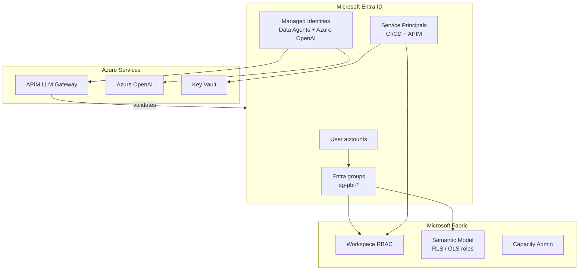

# Entra ID & RBAC

## Identity Architecture

All MKC Fabric authentication and authorisation flows through **Microsoft Entra ID** (formerly Azure Active Directory):

## Entra Group Naming Convention

| Group Pattern | Purpose | Example |
|--------------|---------|---------|
| `sg-fabric-platform-admins` | Fabric capacity + platform workspace admins | IT / Data Engineering leads |
| `sg-fabric-{domain}-members` | Workspace Members (publish content) | `sg-fabric-sales-members` |
| `sg-fabric-{domain}-viewers` | Workspace Viewers (read-only) | `sg-fabric-finance-viewers` |
| `sg-pbi-sales-{region}` | Sales semantic model RLS — by region | `sg-pbi-sales-northkansas` |
| `sg-pbi-finance-{costcenter}` | Financial semantic model RLS — by cost centre | `sg-pbi-finance-corporate` |
| `sg-pbi-ops-{location}` | Operations semantic model RLS — by location | `sg-pbi-ops-moundridge` |
| `sg-pbi-finance-all` | Finance senior staff — see all margins | CFO, Controllers |
| `sg-pbi-hr-all` | HR staff — see salary/rate OLS-protected columns | HR Director, Payroll |

## Service Principal Usage

| Service Principal | Used By | Permissions |
|------------------|---------|-------------|
| `sp-fabric-cicd` | GitHub Actions CI/CD | Fabric workspace API (deploy items) |
| `sp-fabric-purview` | Microsoft Purview scanner | Storage Blob Data Reader on OneLake |
| `sp-dynamics-crm` | Dataflow Gen2 → Dynamics CRM | Dynamics 365 API read permissions |
| `sp-sharepoint` | Dataflow Gen2 → SharePoint | SharePoint.Lists read permissions |

All SP secrets are stored in **Azure Key Vault** and injected via Key Vault references — never hardcoded.

## Managed Identity Usage

Managed Identities are used for service-to-service auth where there is no human user:

| Managed Identity | Service | Used For |
|-----------------|---------|---------|
| `mi-fabric-pipelines` | Fabric Pipelines | Read from Azure SQL MI (if migrated); write to OneLake |
| `mi-apim-gateway` | Azure APIM | Call Azure OpenAI without API keys |
| `mi-data-agents` | Fabric Data Agents | Call APIM LLM Gateway |

!!! success "Zero-Secret Authentication"
    Managed Identities eliminate the need for API keys in code or CI/CD pipelines. There are no Azure OpenAI API keys in any application code, configuration file, or environment variable.

## Workspace RBAC Assignment Matrix

| Workspace | Admin | Member | Contributor | Viewer |
|-----------|-------|--------|-------------|--------|
| Platform workspaces (Bronze/Silver/Gold) | `sg-fabric-platform-admins` | Data Engineers | — | `sg-fabric-platform-viewers` |
| MKC-BI-Sales-Prod | `sg-fabric-platform-admins` | `sg-fabric-sales-members` | — | `sg-pbi-sales-*` |
| MKC-BI-Financial* | `sg-fabric-platform-admins` | `sg-fabric-finance-members` | — | `sg-pbi-finance-*` |
| MKC-BI-Executive | `sg-fabric-platform-admins` | `sg-fabric-exec-members` | — | `sg-fabric-exec-viewers` |
| MKC-DataScience | `sg-fabric-platform-admins` | Data Scientists | — | — |
