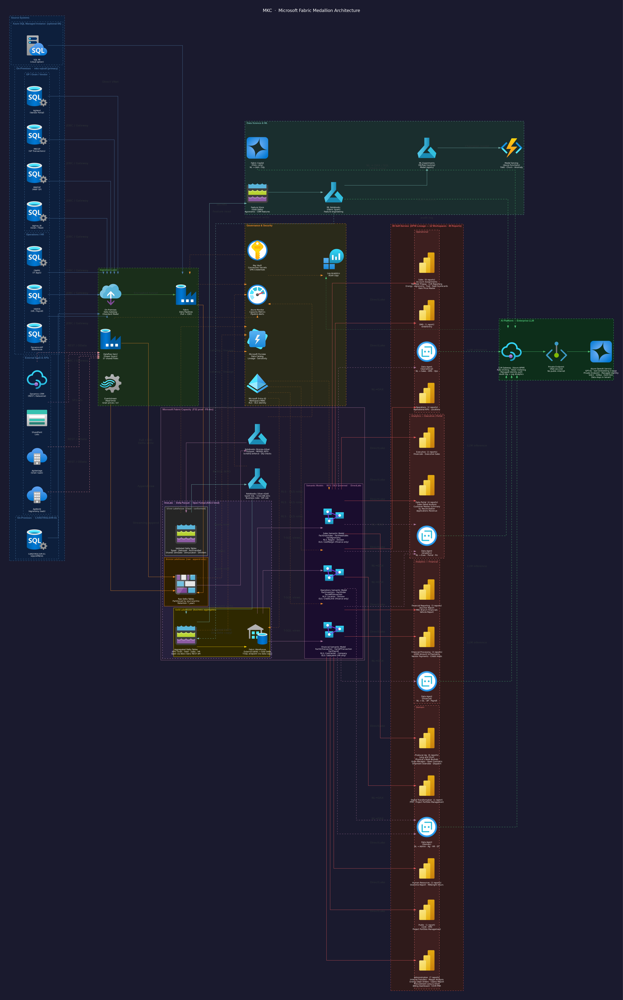

# MKC Data Strategy Assessment

**Microsoft Fabric Medallion Architecture — Assessment, Architecture & Roadmap**

---

MKC (Mid-Kansas Cooperative) is an agricultural co-operative serving grain producers, feed customers, and agronomy clients across the central Kansas region. This assessment evaluates MKC's current data landscape and proposes a unified, governed, AI-enabled data platform built on **Microsoft Fabric**.

## What's Inside

=== "Foundation & Strategy"
    Covers MKC's current state (direct SQL→Power BI, siloed dataflows, no medallion), the target Fabric architecture, a 5-level data maturity assessment, and a phased 3-wave roadmap.

=== "DevOps & Automation"
    Git integration with Azure DevOps or GitHub, CI/CD pipelines for workspace promotion, environment topology (Dev/Test/Prod), and data quality testing strategy.

=== "Data Consumption"
    Auto-generated inventory of all 12 workspaces, 40 reports, 34 dataflows, and 7 SQL + 5 SaaS data sources — derived directly from the MKC PowerBI Inventory spreadsheet.

=== "Fabric Architecture"
    Deep-dive into the Bronze → Silver → Gold → Semantic Model medallion layers, OneLake Delta Parquet storage strategy, star schema design (8 dims + 9 facts), and vendor independence plan.

=== "AI, Data Science & MLOps"
    Enterprise LLM architecture (Azure OpenAI, Private Endpoint, APIM), Fabric Data Agents per workspace group, MLOps pipeline, feature store, and detailed cost scenarios comparing Fabric capacity vs. per-token LLM costs.

=== "Governance & Security"
    Row-Level Security and Object-Level Security implementation per semantic model, Microsoft Purview catalog/lineage, Entra ID RBAC, and compliance matrix (SOC2, HIPAA, ISO27001, GDPR).

=== "FinOps & Observability"
    Full F-SKU pricing reference (F2–F256), three deployment scenarios (Small/Medium/Large), break-even analysis, 10 cost optimization tips, and observability stack (Azure Monitor + Log Analytics + Capacity Metrics).

---

## Architecture Diagram

> **Legend:** See `assets/mkc_fabric_legend.png` for a full icon and edge-color guide.

---

## Key Numbers

| Metric | Value |
|--------|-------|
| Workspaces (DFW Lineage) | 12 |
| Reports | 40 |
| Dataflows | 34 |
| SQL source databases | 7 |
| SaaS / API sources | 5 |
| Fact tables | 9 |
| Shared dimension tables | 8 |
| Recommended F-SKU | F32 (Prod) + F8 (Dev) |
| Estimated monthly cost (Medium) | ~$4,536/mo |

---

!!! tip "Quick Start"
    Jump to [Foundation & Strategy → Executive Summary](01_foundation/executive-summary.md) for a one-page overview, or [Fabric Architecture → Medallion Layers](04_fabric-architecture/medallion.md) for the technical deep dive.
