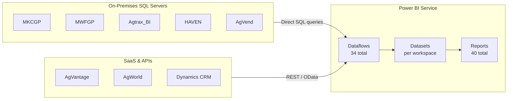

# Current State

## Architecture Overview

MKC's current analytics landscape is characterised by **direct source-to-report connections** with no intermediate storage or transformation layer.

## What Exists Today

### Source Systems

| Server | Role | Databases |
|--------|------|-----------|
| mkc-sqlcall | Primary on-premises GP / operations | MKCGP, MWFGP, Agtrax_BI, ITAPPS, HAVEN, AgVend, DynamicsGPWarehouse |
| CARDTROLSVR-01\SQLEXPRESS | Card control transactions | Card controls |
| AgVantage | Grain SaaS (price feeds, contracts) | REST API |
| AgWorld | Agronomy SaaS (field records) | REST / OAuth2 |
| Dynamics CRM | Customer relationship management | Dataverse / OData v4 |
| SharePoint | HR admin lists | SP.Lists connector |

### Power BI Environment

| Metric | Count |
|--------|-------|
| Workspaces | 12 |
| Reports (DFW Lineage) | 40 |
| Dataflows | 34 |
| Source connections (Source Mapping) | 190 |

### Identified Pain Points

!!! danger "No Medallion Architecture"
    Reports query operational source systems directly. There is no raw data replica (Bronze), no cleaning/conforming layer (Silver), and no agreed business aggregates (Gold). Business logic is embedded inside individual Power Query dataflows, leading to diverging definitions.

!!! warning "Duplicated Business Logic"
    Many of the 34 dataflows independently re-implement the same transformations (date dimensions, location hierarchies, customer lookups) with slight variations, causing discrepancies between reports.

!!! warning "No Systematic Data Quality"
    There are no automated checks for null values, referential integrity, or schema drift. Bad data surfaces in reports only when business users notice anomalies.

!!! warning "Weak Security Model"
    Security is enforced at the workspace level (who can access a workspace) but not at the row or column level within datasets. A Sales user who gains workspace access can see all regions and all margins.

!!! warning "No Lineage or Catalog"
    Tracing a KPI back to its source table requires manual investigation across Power Query steps, dataflow definitions, and source database schemas. There is no automated lineage or data dictionary.

!!! info "Existing Assets to Preserve"
    - 34 dataflows (Power Query M code) — reusable as Dataflow Gen2 items in Fabric
    - 40 reports (PBIX) — reusable in Fabric workspaces with re-pointed datasets
    - Business knowledge embedded in existing transformations informs Silver-layer logic

---

## References

| Resource | Description |
|----------|-------------|
| [Power BI Dataflows (Gen1) overview](https://learn.microsoft.com/en-us/power-bi/transform-model/dataflows/dataflows-introduction-self-service) | Introduction to self-service dataflows and Power Query in Power BI |
| [Power BI workspaces](https://learn.microsoft.com/en-us/power-bi/collaborate-share/service-new-workspaces) | Creating and managing collaborative workspaces in Power BI Service |
| [On-Premises Data Gateway](https://learn.microsoft.com/en-us/data-integration/gateway/service-gateway-onprem) | Gateway installation, configuration, and monitoring for on-prem SQL sources |
| [Power BI data lineage](https://learn.microsoft.com/en-us/power-bi/collaborate-share/service-data-lineage) | Viewing dataset and dataflow lineage in Power BI Service |
