# Environment Topology

## Three-Tier Model

MKC operates three Fabric environments, each a distinct Fabric workspace connected to its own Git branch:

```mermaid
flowchart LR
    subgraph Dev["Dev (F8 — paused off-hours)"]
        D1[Bronze-Dev LH]
        D2[Silver-Dev LH]
        D3[Gold-Dev LH]
        D4[Semantic Models Dev]
    end
    subgraph Test["Test (F8 — always on)"]
        T1[Bronze-Test LH]
        T2[Silver-Test LH]
        T3[Gold-Test LH]
        T4[Semantic Models Test]
    end
    subgraph Prod["Prod (F32 — always on)"]
        P1[Bronze-Prod LH]
        P2[Silver-Prod LH]
        P3[Gold-Prod LH]
        P4[Semantic Models Prod]
        P5[BI Workspaces × 12]
    end

    Dev -->|PR merge + DQ tests| Test
    Test -->|Manual approval gate| Prod
```



## Environment Comparison

| Property | Dev | Test | Prod |
|----------|-----|------|------|
| F-SKU | F8 (paused nights/weekends) | F8 | F32 |
| Est. monthly cost | ~$200 (paused) | ~$600 | ~$4,194 |
| Git branch | `dev` | `main` | `release/vX.Y` |
| Source data | Subset / synthetic | Last 90 days real | Full historical |
| BI workspaces | Developer only | Tester + UAT users | All 12 workspaces |
| Auto-refresh pipelines | On-demand | Daily | Hourly CDC |
| Purview scanning | Off | Off | On |

## Workspace Naming Convention

```
MKC-{Layer}-{Environment}

Examples:
  MKC-Bronze-Prod
  MKC-Silver-Dev
  MKC-Gold-Test
  MKC-SemanticModels-Prod
  MKC-BI-Sales-Prod
  MKC-BI-Financial-Prod
```

## OneLake Path Convention

OneLake paths follow the same pattern so notebooks can use a single `ENV` parameter:

```
onelake://{workspace}/Bronze-{ENV}.Lakehouse/Tables/{source_table}
onelake://{workspace}/Silver-{ENV}.Lakehouse/Tables/{entity}
onelake://{workspace}/Gold-{ENV}.Lakehouse/Tables/{fact_or_dim}
```

Notebooks receive `ENV` as a parameter cell:

```python
# parameters
ENV = "dev"   # overridden by CI/CD to "test" or "prod"
WORKSPACE = f"MKC-Bronze-{ENV.capitalize()}"
BRONZE_PATH = f"abfss://{WORKSPACE}@onelake.dfs.fabric.microsoft.com/..."
```

## Capacity Pause Schedule

Dev capacity is paused outside working hours to reduce cost:

| Day | Active Hours | Paused Hours |
|-----|-------------|-------------|
| Mon–Fri | 07:00–19:00 CST | 19:00–07:00 CST |
| Sat–Sun | On-demand only | All day |

Pause/resume is managed by an **Azure Logic App** calling the Fabric REST API:
```
POST https://api.fabric.microsoft.com/v1/capacities/{capacityId}/resume
POST https://api.fabric.microsoft.com/v1/capacities/{capacityId}/suspend
```

!!! info "Cost Impact"
    Pausing Dev F8 nights and weekends reduces it from ~$1,100/month to ~$200/month — a ~82% saving on the dev capacity.
