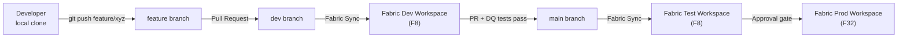

# Git Workflow

## Fabric Git Integration

Microsoft Fabric natively integrates with **Azure DevOps Git** or **GitHub** repositories. Each Fabric workspace is connected to a specific branch of the repository, enabling workspace items (Notebooks, Dataflow Gen2, Pipelines, Semantic Models) to be version-controlled as YAML/JSON definition files.



## Branch Strategy

| Branch | Synced Workspace | Purpose |
|--------|-----------------|---------|
| `feature/*` | None (PR only) | Developer sandbox for new features |
| `dev` | Dev Workspace (F8) | Integration testing of in-progress work |
| `main` | Test Workspace (F8) | Staging for UAT and QA sign-off |
| `release/vX.Y` | Prod Workspace (F32) | Production-deployed, tagged versions |

## Repository Structure

```
mkc-fabric/
├── workspaces/
│   ├── dev/
│   │   ├── notebooks/
│   │   │   ├── bronze_silver/
│   │   │   └── silver_gold/
│   │   ├── pipelines/
│   │   ├── dataflows/
│   │   └── semantic_models/
│   ├── prod/
│   │   └── (same structure)
├── .github/
│   └── workflows/
│       ├── ci.yml           # lint, DQ check on PR
│       └── promote.yml      # workspace promotion on merge to main
├── scripts/
│   ├── deploy.py            # Fabric REST API workspace deploy
│   └── dq_check.py          # data quality smoke tests
└── README.md
```

## Pull Request Rules

1. **Minimum 1 reviewer** for any change to `dev` or `main`
2. **CI checks must pass** before merge (lint + DQ smoke test)
3. **No direct commits** to `main` or `release/*` branches
4. **Squash merges** preferred — keeps `main` history clean

## Workspace-to-Branch Mapping

Fabric workspaces are configured in the Fabric portal under **Workspace Settings → Git Integration**:

| Workspace | Repository Branch | Auto-sync |
|-----------|------------------|-----------|
| MKC-Dev | `dev` | On push |
| MKC-Test | `main` | Manual trigger |
| MKC-Prod | `release/vX.Y` | Manual after approval |

!!! tip "Notebook Parameters"
    Use Fabric Notebook parameters (top-cell `parameters` tag) combined with environment variable substitution in CI/CD to point notebooks at Dev vs. Prod OneLake paths without code changes.
