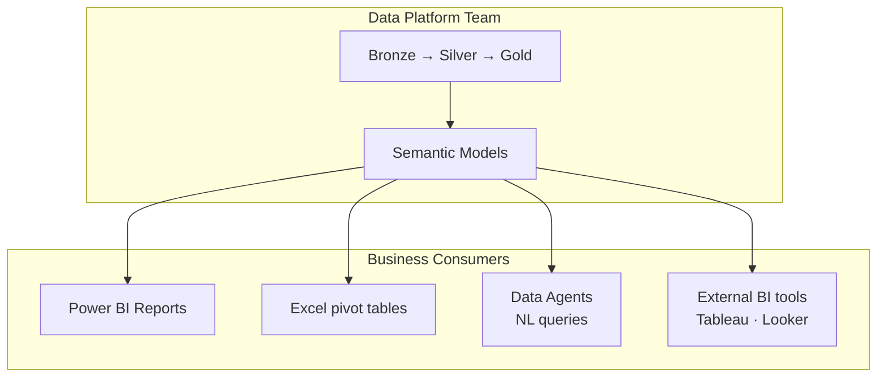

# Self-Service Strategy

## Guiding Principle: Semantic Model as a Product

In the target architecture, MKC's three semantic models (**Sales**, **Financial**, **Operations**) are treated as **data products** — governed, versioned, and maintained by a central data team. Business users consume these products without needing to understand the underlying Bronze/Silver/Gold layers.

## Layers of Self-Service

| Layer | Audience | Tool | Access Level |
|-------|----------|------|-------------|
| **Governed reports** | All business users | Power BI Service | View reports (no Pro license needed on F-SKU) |
| **Explore mode** | Power users | Power BI Desktop | Connect to semantic model, build own visuals |
| **Data Agents** | Any user | Teams / Portal chat | Ask questions in plain English |
| **Gold Warehouse T-SQL** | Analysts / data scientists | Excel, Tableau, SSMS | Read-only via JDBC/ODBC; governed by Entra RBAC |
| **Notebook authoring** | Data scientists | Fabric Notebooks | Read from Silver/Gold; write to feature store only |

## Power BI Workspace Strategy

Each of the 12 workspaces corresponds to a **business domain** and is governed by the same Entra groups that control the underlying semantic model RLS/OLS rules:

| Workspace Group | Workspaces | Primary Semantic Model |
|----------------|-----------|----------------------|
| Operational | Sales, OMS, Operations | Sales |
| Analytics | Executive, Data Portal, Financial Reporting, Financial Processing | Sales + Financial + Operations |
| Domain | Administration, Producer Ag, Human Resources, Digital Transformation | Financial + Operations |
| Public | Public | Financial (admin/project) |

## Enabling Self-Service Safely

### What Users Can Do
- Build new Power BI reports in their workspace against the shared semantic model
- Create personal bookmarks, subscriptions, and alerts
- Export data to Excel within their RLS-filtered row scope
- Ask Data Agents questions — answers are RLS-filtered to their role

### What Users Cannot Do
- Modify the semantic model definition or RLS roles
- Access columns hidden by OLS (cost margins, salary amounts, credit limits)
- Connect to Bronze or Silver Lakehouses directly
- Run notebooks against production OneLake without IT approval

### Promotion Process
When a user-created report is ready for wider sharing:
1. Report is reviewed by the data team for metric consistency
2. RLS rules are verified against the semantic model
3. Report is promoted to the governed workspace via Git PR
4. It appears in the official DFW Lineage inventory on next extraction

## Data Mesh Considerations

MKC's domain structure maps cleanly to data mesh principles:

| Data Mesh Concept | MKC Implementation |
|-------------------|-------------------|
| Domain ownership | Each workspace group has a nominated **data owner** (e.g., Finance Director owns Financial workspace) |
| Data as a product | Semantic models are SLA-governed products with documented freshness and quality metrics |
| Self-serve platform | Fabric capacity + DirectLake removes per-user infrastructure provisioning |
| Federated governance | Purview applies organisation-wide sensitivity labels; domain owners manage workspace membership |

---

## References

| Resource | Description |
|----------|-------------|
| [Self-service analytics in Power BI](https://learn.microsoft.com/en-us/power-bi/fundamentals/service-self-service-signup-for-power-bi) | Enabling end-users to build and share their own reports in Power BI Service |
| [Power BI semantic model best practices](https://learn.microsoft.com/en-us/power-bi/guidance/report-separate-from-model) | Separating reports from semantic models for governed self-service |
| [DirectLake mode for semantic models](https://learn.microsoft.com/en-us/fabric/get-started/direct-lake-overview) | Zero-copy semantic model access to OneLake Delta tables |
| [Data mesh scenario — Cloud Adoption Framework](https://learn.microsoft.com/en-us/azure/cloud-adoption-framework/scenarios/cloud-scale-analytics/architectures/data-mesh-scenario) | Domain-oriented data ownership and federated governance patterns |
| [Fabric workspace roles](https://learn.microsoft.com/en-us/fabric/get-started/roles-workspaces) | Admin, Member, Contributor, and Viewer role definitions for Fabric workspaces |
