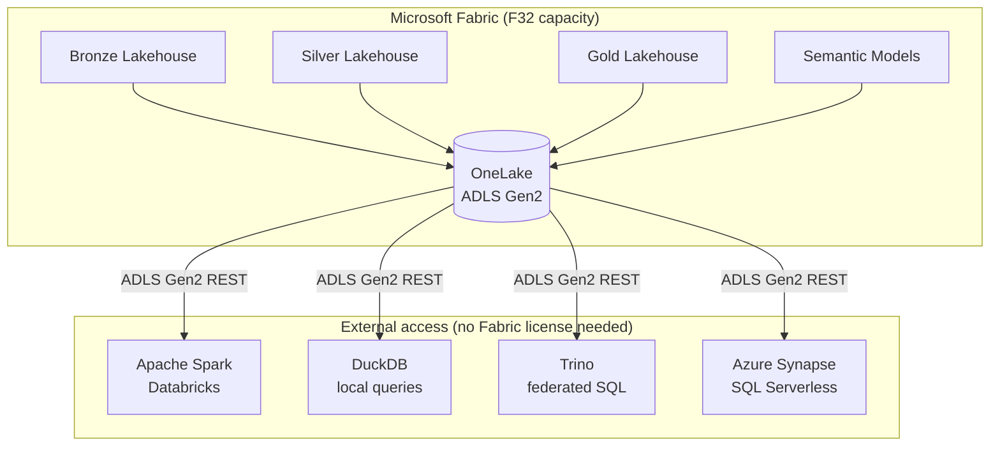

# OneLake & Delta Parquet

## What is OneLake?

**OneLake** is Microsoft Fabric's unified storage layer — a single, multi-cloud data lake that underpins every Fabric workspace. Under the hood, OneLake is **Azure Data Lake Storage Gen2 (ADLS Gen2)**, which means all data stored in Fabric is accessible via standard ADLS Gen2 REST APIs without any Fabric license.



## Delta Parquet — Why This Format?

All MKC data is stored as **Delta Parquet** — the combination of Apache Parquet column storage with the Delta Lake transaction log.

| Property | Benefit for MKC |
|----------|----------------|
| **Columnar storage** | Analytics queries read only relevant columns — 10–100× faster than row-oriented formats |
| **ACID transactions** | MERGE INTO (Silver upserts) are atomic — no partial writes visible to readers |
| **Time travel** | `VERSION AS OF` queries let you audit data as it was at any point in the past |
| **Schema evolution** | Add columns without rewriting existing data |
| **Open format** | No vendor license required to read — Linux Foundation governed |
| **Z-ordering** | Co-locate related data (by date or location) for faster selective reads |

## OneLake Storage Layout

```
onelake://<tenant-id>/
├── MKC-Bronze-Prod.Lakehouse/
│   └── Tables/
│       ├── mkcgp_iv30300/        ← Delta table (inventory)
│       ├── mkcgp_rm00101/        ← Delta table (customers)
│       ├── agtrax_bi_sales/      ← Delta table
│       └── ...
├── MKC-Silver-Prod.Lakehouse/
│   └── Tables/
│       ├── dim_customer/
│       ├── dim_location/
│       ├── grain_sale_transaction/
│       └── ...
├── MKC-Gold-Prod.Lakehouse/
│   └── Tables/
│       ├── FactGrainSales/
│       ├── FactGLTransaction/
│       └── DimDate/
└── MKC-SemanticModels-Prod/      ← Fabric workspace items (.pbidataset)
    ├── Sales.SemanticModel/
    ├── Financial.SemanticModel/
    └── Operations.SemanticModel/
```

## Delta Time Travel

Bronze keeps **7 years** of history via Delta's `VACUUM` retention policy:

```python
# Set retention to 7 years (2,555 days)
spark.sql("""
    ALTER TABLE Bronze.mkcgp_iv30300
    SET TBLPROPERTIES ('delta.logRetentionDuration' = 'interval 2555 days',
                       'delta.deletedFileRetentionDuration' = 'interval 2555 days')
""")

# Query data as of a specific date
spark.sql("""
    SELECT * FROM Bronze.mkcgp_iv30300
    TIMESTAMP AS OF '2023-01-01'
""")
```

## Accessing OneLake Without Fabric

Gold data is accessible by any ADLS Gen2-compatible engine using standard credentials:

```python
# DuckDB — no Fabric license, just ADLS Gen2 credentials
import duckdb

conn = duckdb.connect()
conn.execute("INSTALL azure; LOAD azure;")
conn.execute("""
    CREATE SECRET mkc_onelake (
        TYPE AZURE,
        ACCOUNT_NAME 'onelake',
        TENANT_ID '...',
        CLIENT_ID '...',
        CLIENT_SECRET '...'
    )
""")
result = conn.execute("""
    SELECT * FROM delta_scan(
        'abfss://MKC-Gold-Prod@onelake.dfs.fabric.microsoft.com/Tables/FactGrainSales'
    )
""").fetchdf()
```

!!! tip "Vendor Independence"
    If MKC ever migrates away from Microsoft Fabric, every byte of data in OneLake is immediately accessible without any migration — just point a new engine at the same ADLS Gen2 paths. See [Vendor Independence](vendor-independence.md) for the full strategy.

---

## References

| Resource | Description |
|----------|-------------|
| [OneLake overview](https://learn.microsoft.com/en-us/fabric/onelake/onelake-overview) | Architecture, access patterns, and multi-cloud capabilities of OneLake |
| [OneLake file explorer](https://learn.microsoft.com/en-us/fabric/onelake/onelake-file-explorer) | Windows Explorer integration for browsing OneLake Delta tables |
| [Azure Data Lake Storage Gen2](https://learn.microsoft.com/en-us/azure/storage/blobs/data-lake-storage-introduction) | Underlying ADLS Gen2 storage layer — REST APIs, authentication, access control |
| [Delta Lake documentation](https://docs.delta.io/latest/index.html) | Open-source Delta Lake — ACID transactions, time travel, schema evolution |
| [DuckDB Azure extension](https://duckdb.org/docs/extensions/azure) | Querying ADLS Gen2 / OneLake Delta files directly from DuckDB |
