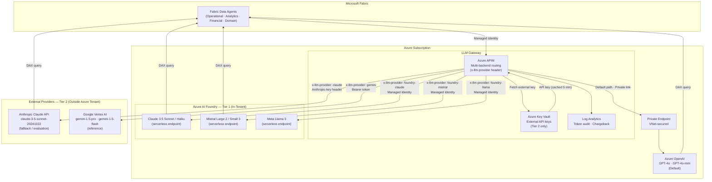
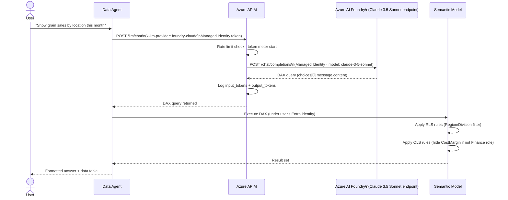

# Alternative LLM Providers for Data Agents

Azure OpenAI Service is the default and recommended LLM platform for MKC's Data Agents — it delivers GPT-4-class models entirely within the Microsoft tenant boundary with Managed Identity authentication and Private Endpoint network isolation. This page documents how the architecture can be extended to support non-Azure LLMs when model capability, cost benchmarking, or vendor resilience requirements warrant it. All patterns route through the existing [Azure APIM gateway](llm-architecture.md) so governance, audit logging, and Fabric Data Agent configuration remain unchanged.

## Why Consider Alternatives?

Three scenarios justify evaluating alternatives:

1. **Model capability comparison** — Claude 3.5 Sonnet and Mistral Large have demonstrated strong structured-output and code-generation performance for tasks similar to NL→DAX translation. A quantified A/B evaluation against GPT-4o is worth running before committing to a single provider long-term.
2. **Cost benchmarking** — Claude Haiku and Mistral Small are priced in the same range as GPT-4o-mini; having pricing parity data informs future procurement decisions as query volume grows.
3. **Vendor resilience** — a documented fallback path means the Data Agent platform can continue operating during Azure OpenAI regional outages or quota exhaustion events.

!!! warning "What You Lose by Leaving the Azure Tenant Boundary"
    Azure OpenAI's compliance posture rests on three pillars: data never leaves the tenant (Private Endpoint), no API keys in code (Managed Identity), and a single audit trail (APIM → Log Analytics). External providers (Tier 2 below) break the first two pillars. Always engage the CISO and review the provider's Data Protection Addendum before routing real MKC data outside the Azure tenant.

---

## Providers Covered — Two Tiers

Providers are grouped by whether they keep data inside the Azure tenant boundary.

**Tier 1 — In-Tenant (preferred):** Models deployed through **Azure AI Foundry** as serverless pay-as-you-go endpoints. Authentication uses Managed Identity via the `azure-ai-inference` SDK. Data stays inside Azure. No external API keys. Covers: Anthropic Claude 3.5 Sonnet/Haiku, Mistral Large 2/Small 3, Meta Llama 3, Cohere Command.

**Tier 2 — External (evaluation/fallback):** Models accessed via their native provider APIs outside Azure. Requires external API keys stored in Azure Key Vault. Data leaves the Azure tenant boundary on every request. Covers: Claude via direct Anthropic API, Google Gemini via Vertex AI.

!!! tip "MKC Preferred Path for Claude"
    **Claude via Azure AI Foundry (Tier 1)** is strongly preferred over the direct Anthropic API (Tier 2). It uses the same Managed Identity authentication and Azure billing as Azure OpenAI, keeps all prompt data within the Azure ecosystem, and requires only a backend URL change in APIM — no body transformation, no Key Vault integration for API keys.

---

## Architecture Changes Required

### What Changes vs. What Stays the Same

**Unchanged:**

- Fabric Data Agent items (same Fabric workspace items, same NL input interface)
- Azure APIM as the single LLM gateway (all traffic still passes through APIM)
- APIM policies for rate limiting, audit logging, and token metering
- DAX execution under the user's own Entra identity (RLS/OLS automatically enforced)
- Log Analytics workspace for the full token audit trail

**Changed:**

- APIM backend pool: add Azure AI Foundry endpoints (Tier 1) or external API URLs (Tier 2)
- APIM routing policy: add `x-llm-provider` header inspection to choose the backend
- Authentication: Managed Identity works for Azure AI Foundry; Tier 2 providers need an API key fetched from Key Vault
- Data Agent endpoint config: the APIM operation URL the agent calls points to a new route

### Multi-LLM Architecture



### Claude Data Agent Flow via Azure AI Foundry



!!! info "No Key Vault Step"
    Unlike the Tier 2 direct API path, the Azure AI Foundry flow uses Managed Identity throughout — the same pattern as the default Azure OpenAI path. APIM authenticates to the Foundry endpoint using its system-assigned Managed Identity; no external API keys are stored or rotated.

---

## Key Vault Integration for Tier 2 External API Keys

This section applies only if using Tier 2 providers (direct Anthropic API or Google Vertex AI). Skip if using Azure AI Foundry exclusively.

### Why Key Vault Over APIM Named Values

APIM Named Values can store secrets but they are scoped to APIM and lack independent audit trails. Azure Key Vault provides:

- Independent RBAC (security team controls Key Vault; platform team controls APIM)
- Full audit log of every secret access in Azure Monitor
- Automatic rotation capability (APIM polls on a schedule)
- Separation of duties: developer code never sees the raw key value

### Setup Steps

1. Create an Azure Key Vault in the same subscription as APIM
2. Grant APIM's system-assigned Managed Identity the `Key Vault Secrets User` role (not `Key Vault Contributor` — least privilege)
3. Store each provider's API key as a named secret:
   - `anthropic-api-key` — Anthropic API key (`sk-ant-...`)
   - `google-vertex-sa-key` — base64-encoded Service Account JSON (see Gemini tab below)
4. In the APIM inbound policy, use `send-request` to fetch the secret from the Key Vault REST API
5. Cache the secret in APIM's in-memory cache (`cache-store-value`) with a **5-minute TTL** to avoid a Key Vault call on every request

!!! warning "Cache Scale-Out Behaviour"
    APIM's in-memory cache is per gateway unit. If APIM scales out to multiple units, each unit has its own cache, so Key Vault will receive up to `N × (1 per 5 min)` requests where N is the number of APIM units. For high-scale deployments, use an external Redis cache shared across gateway units.

---

## Implementation Patterns

=== "Azure AI Foundry — Tier 1 (Recommended)"

    ### Model Catalog

    Azure AI Foundry hosts third-party models as serverless pay-as-you-go endpoints within the Azure tenant. Relevant models for MKC:

    | Model | Publisher | Context | DAX Use Case |
    |-------|-----------|---------|--------------|
    | `claude-3-5-sonnet` | Anthropic | 200K | Complex multi-table NL→DAX |
    | `claude-3-5-haiku` | Anthropic | 200K | Simple lookups, high-volume |
    | `mistral-large-2407` | Mistral AI | 128K | Complex queries |
    | `mistral-small` | Mistral AI | 128K | High-volume classification |
    | `Meta-Llama-3-70B-Instruct` | Meta | 8K | Alternative evaluation |

    ### Python — `azure-ai-inference` SDK

    The `azure-ai-inference` SDK provides a unified interface for all Azure AI Foundry models and normalises responses to an OpenAI-compatible schema — `choices[0].message.content` works identically for Claude, Mistral, and Llama.

    ```python
    from azure.ai.inference import ChatCompletionsClient
    from azure.ai.inference.models import SystemMessage, UserMessage
    from azure.identity import DefaultAzureCredential

    # Foundry endpoint URL from: Azure AI Foundry → Project → Deployments → Endpoint
    FOUNDRY_ENDPOINT = "https://{project-name}.{region}.inference.ml.azure.com"

    client = ChatCompletionsClient(
        endpoint=FOUNDRY_ENDPOINT,
        credential=DefaultAzureCredential()  # Managed Identity — no API key
    )

    SYSTEM_PROMPT = """You are a data analyst assistant for MKC (Mid-Kansas Cooperative).
    [... same schema and rules as data-agents.md system prompt ...]"""

    def generate_dax(question: str, model: str = "claude-3-5-sonnet") -> str:
        """Generate DAX from natural language via Azure AI Foundry."""
        response = client.complete(
            messages=[
                SystemMessage(content=SYSTEM_PROMPT),
                UserMessage(content=question)
            ],
            model=model,       # Foundry deployment name — switch model here
            max_tokens=512,
            temperature=0.0    # deterministic output for DAX generation
        )
        return response.choices[0].message.content  # OpenAI-compatible shape
    ```

    !!! info "Same Response Shape for All Foundry Models"
        The `azure-ai-inference` SDK normalises Claude, Mistral, and Llama responses to the same `choices[0].message.content` structure. No APIM outbound body transformation is needed — the Fabric Data Agent reads the response identically regardless of which Foundry model served the request.

    ### APIM Policy — Foundry Backend Routing

    Extend the existing APIM policy from [Enterprise LLM Architecture](llm-architecture.md) with a Foundry backend route. No Key Vault integration needed — Managed Identity handles auth.

    ```xml
    <policies>
      <inbound>
        <!-- Existing: validate Entra Managed Identity token -->
        <validate-jwt header-name="Authorization" failed-validation-httpcode="401">
          <openid-config url="https://login.microsoftonline.com/{tenant-id}/.well-known/openid-configuration"/>
        </validate-jwt>

        <!-- Existing: per-workspace rate limit -->
        <quota-by-key calls="100000" bandwidth="50000000"
                      renewal-period="60"
                      counter-key="@(context.Request.Headers.GetValueOrDefault("x-workspace-id", "default"))" />

        <!-- NEW: route to Azure AI Foundry if requested -->
        <choose>
          <when condition="@(context.Request.Headers.GetValueOrDefault("x-llm-provider","azure").StartsWith("foundry-"))">
            <set-backend-service base-url="https://{foundry-project}.{region}.inference.ml.azure.com" />
            <!-- Managed Identity token for AI Foundry — same scope as Azure OpenAI -->
            <authentication-managed-identity resource="https://cognitiveservices.azure.com" />
            <!-- Pass model name derived from the provider header suffix -->
            <set-variable name="foundryModel"
              value="@(context.Request.Headers.GetValueOrDefault("x-llm-provider").Replace("foundry-",""))" />
          </when>
          <otherwise>
            <!-- Default: Azure OpenAI via Private Endpoint -->
            <set-backend-service base-url="https://{aoai-resource}.openai.azure.com/openai/deployments/gpt-4o" />
            <set-header name="api-key" exists-action="override">
              <value>{{azure-openai-key}}</value>
            </set-header>
          </otherwise>
        </choose>
      </inbound>

      <outbound>
        <!-- Existing: log token usage (Foundry models use same usage.total_tokens schema) -->
        <log-to-eventhub logger-id="token-usage-logger">
          @($"workspace={context.Request.Headers["x-workspace-id"]},provider={context.Request.Headers.GetValueOrDefault("x-llm-provider","azure")},tokens={context.Response.Body.As<JObject>(preserveContent:true)["usage"]["total_tokens"]}")
        </log-to-eventhub>
      </outbound>
    </policies>
    ```

=== "Anthropic Claude Direct API — Tier 2"

    ### When to Use

    Use the direct Anthropic API only when a Claude model version is not yet available in the Azure AI Foundry catalog, or during an initial proof-of-concept on synthetic/anonymised data before Foundry onboarding is complete.

    !!! warning "Data Residency — Tier 2"
        Prompts sent to `api.anthropic.com` leave the Azure tenant boundary and transit the public internet. MKC producer financial data, grain positions, and employee data classified as **Confidential or Highly Confidential** must **not** be sent via this path without a CISO-approved Data Protection Addendum with Anthropic. Use synthetic or anonymised data for all evaluations.

    ### Key API Difference: Claude vs. OpenAI

    !!! info "Claude Messages API — System Prompt Placement"
        Claude's API accepts `system` as a **top-level parameter**, not as a `{"role": "system"}` entry inside the `messages` array. This is the most common integration mistake when porting from OpenAI SDK code.

        ```python
        # OpenAI pattern (WRONG for Claude):
        messages=[{"role": "system", "content": SYSTEM_PROMPT}, {"role": "user", "content": q}]

        # Claude pattern (CORRECT):
        system=SYSTEM_PROMPT,
        messages=[{"role": "user", "content": q}]
        ```

    ### Python — `anthropic` SDK

    ```python
    import anthropic
    from azure.identity import DefaultAzureCredential
    from azure.keyvault.secrets import SecretClient

    # Retrieve API key from Key Vault at startup — never hardcode
    kv_client = SecretClient(
        vault_url="https://{keyvault-name}.vault.azure.net",
        credential=DefaultAzureCredential()
    )
    api_key = kv_client.get_secret("anthropic-api-key").value

    client = anthropic.Anthropic(api_key=api_key)

    SYSTEM_PROMPT = """You are a data analyst assistant for MKC (Mid-Kansas Cooperative).
    [... same schema and rules as data-agents.md system prompt ...]"""

    def generate_dax_with_claude(question: str) -> str:
        """Generate DAX from natural language using Anthropic Claude directly."""
        message = client.messages.create(
            model="claude-3-5-sonnet-20241022",
            max_tokens=512,
            system=SYSTEM_PROMPT,          # top-level system parameter
            messages=[
                {"role": "user", "content": question}
            ]
        )
        return message.content[0].text     # NOT choices[0].message.content
    ```

    ### APIM Policy — Direct Claude Backend

    ```xml
    <policies>
      <inbound>
        <!-- ... existing JWT validation and rate limit policies ... -->

        <!-- Fetch Anthropic key from Key Vault (cached 5 min) -->
        <cache-lookup-value key="anthropic-api-key" variable-name="anthropicKey" />
        <choose>
          <when condition="@(context.Variables.GetValueOrDefault<string>("anthropicKey") == null)">
            <send-request mode="new" response-variable-name="kvResp" timeout="5">
              <set-url>https://{keyvault-name}.vault.azure.net/secrets/anthropic-api-key/?api-version=7.4</set-url>
              <set-method>GET</set-method>
              <authentication-managed-identity resource="https://vault.azure.net" />
            </send-request>
            <set-variable name="anthropicKey"
              value="@(((IResponse)context.Variables["kvResp"]).Body.As<JObject>()["value"].ToString())" />
            <cache-store-value key="anthropic-api-key"
              value="@((string)context.Variables["anthropicKey"])"
              duration="300" />
          </when>
        </choose>

        <choose>
          <when condition="@(context.Request.Headers.GetValueOrDefault("x-llm-provider") == "claude")">
            <set-backend-service base-url="https://api.anthropic.com/v1" />
            <set-header name="x-api-key" exists-action="override">
              <value>@((string)context.Variables["anthropicKey"])</value>
            </set-header>
            <set-header name="anthropic-version" exists-action="override">
              <value>2023-06-01</value>
            </set-header>
            <!-- Transform OpenAI-format body to Claude Messages API format -->
            <set-body>@{
              var body = context.Request.Body.As<JObject>(preserveContent: true);
              var messages = body["messages"] as JArray;
              string systemPrompt = "";
              var claudeMessages = new JArray();
              foreach (var msg in messages) {
                if (msg["role"].ToString() == "system") {
                  systemPrompt = msg["content"].ToString();
                } else {
                  claudeMessages.Add(msg);
                }
              }
              return new JObject {
                ["model"] = "claude-3-5-sonnet-20241022",
                ["max_tokens"] = 512,
                ["system"] = systemPrompt,
                ["messages"] = claudeMessages
              }.ToString();
            }</set-body>
          </when>
        </choose>
      </inbound>

      <outbound>
        <!-- Normalise Claude response to OpenAI shape for Fabric Data Agent SDK compatibility -->
        <choose>
          <when condition="@(context.Request.Headers.GetValueOrDefault("x-llm-provider") == "claude")">
            <set-body>@{
              var body = context.Response.Body.As<JObject>(preserveContent: true);
              var text = body["content"]?[0]?["text"]?.ToString() ?? "";
              var inputTokens = body["usage"]?["input_tokens"]?.ToObject<int>() ?? 0;
              var outputTokens = body["usage"]?["output_tokens"]?.ToObject<int>() ?? 0;
              return new JObject {
                ["choices"] = new JArray {
                  new JObject {
                    ["message"] = new JObject {
                      ["role"] = "assistant",
                      ["content"] = text
                    }
                  }
                },
                ["usage"] = new JObject {
                  ["total_tokens"] = inputTokens + outputTokens
                }
              }.ToString();
            }</set-body>
          </when>
        </choose>
        <!-- Log token usage -->
        <log-to-eventhub logger-id="token-usage-logger">
          @($"workspace={context.Request.Headers["x-workspace-id"]},provider=claude-direct,tokens={context.Response.Body.As<JObject>(preserveContent:true)["usage"]["total_tokens"]}")
        </log-to-eventhub>
      </outbound>
    </policies>
    ```

    !!! warning "Response Format Transformation"
        Claude returns `content[0].text`; the Fabric Data Agent SDK (and the existing hybrid routing code) expects `choices[0].message.content`. The outbound `set-body` policy above normalises the response. If the APIM C# expression approach proves difficult to maintain, replace it with a thin **Azure Function** shim between APIM and the Anthropic API — the Function handles transformation and APIM calls the Function as its backend.

=== "Google Gemini via Vertex AI — Tier 2"

    ### When to Use

    Google Gemini via Vertex AI is documented primarily for cost benchmarking — Gemini 1.5 Flash is among the lowest-cost options listed. However, it involves the most authentication complexity of any provider covered here.

    !!! warning "Data Residency — Tier 2"
        Prompts sent to Vertex AI leave the Azure tenant boundary and are processed in Google Cloud. Apply the same CISO review requirement as the direct Anthropic API path.

    ### Authentication Complexity

    Vertex AI uses a **Google Service Account JSON key** — a multi-line JSON document containing a private key, not a simple string. Storing this in Azure Key Vault requires one of:

    - **Base64-encode** the JSON and store as a Key Vault Secret string (decode in APIM or application code)
    - Store as a **Key Vault Certificate** with the JSON embedded
    - Use **Workload Identity Federation** (Google's equivalent of Managed Identity) — the cleanest long-term approach for hybrid Azure+GCP environments

    !!! tip "Prefer Workload Identity Federation"
        Workload Identity Federation lets a Google Service Account trust the MKC Azure tenant as an identity provider. APIM's Managed Identity token is exchanged for a short-lived Google OAuth token — no JSON key stored anywhere. Recommended if MKC adopts Vertex AI for production use.

    ### Python — `google-cloud-aiplatform` SDK

    ```python
    import vertexai
    from vertexai.generative_models import GenerativeModel

    # Authenticate with a Service Account JSON key file (dev/test)
    # In production: use Workload Identity Federation or Application Default Credentials
    vertexai.init(project="mkc-gcp-project", location="us-central1")

    model = GenerativeModel("gemini-1.5-pro")

    def generate_dax_with_gemini(question: str) -> str:
        """Generate DAX from natural language using Google Gemini 1.5 Pro."""
        # Gemini 1.5 merges system context and user question into one content block.
        # Gemini 2.0+ supports a dedicated system_instruction parameter.
        prompt = f"{SYSTEM_PROMPT}\n\n{question}"
        response = model.generate_content(prompt)
        return response.text
    ```

    !!! info "No Separate System Parameter (Gemini 1.5)"
        Gemini 1.5 Pro/Flash does not have a separate `system` parameter — the system prompt is prepended to the first user content block. Gemini 2.0+ adds `system_instruction` support, aligning more closely with the OpenAI and Claude patterns.

---

## Comparison Tables

### Model Capability for NL→DAX

| Model | Provider | Context | DAX / Code Quality | Instruction Following | p50 Latency |
|-------|----------|---------|--------------------|-----------------------|-------------|
| **GPT-4o** | Azure OpenAI | 128K | Excellent | Excellent | ~800 ms |
| **GPT-4o-mini** | Azure OpenAI | 128K | Good | Good | ~300 ms |
| **Claude 3.5 Sonnet** | Azure AI Foundry / Anthropic | 200K | Excellent | Excellent | ~900 ms |
| **Claude 3.5 Haiku** | Azure AI Foundry / Anthropic | 200K | Good | Very Good | ~400 ms |
| **Mistral Large 2** | Azure AI Foundry | 128K | Good | Good | ~700 ms |
| **Mistral Small 3** | Azure AI Foundry | 128K | Fair | Fair | ~350 ms |
| **Gemini 1.5 Pro** | Google Vertex AI | 1M | Very Good | Good | ~1,200 ms |
| **Gemini 1.5 Flash** | Google Vertex AI | 1M | Good | Good | ~500 ms |

!!! info "These Are Estimates"
    NL→DAX-specific benchmarks for agricultural/finance domain data are not publicly available. Latency figures above are indicative only. MKC should build a **golden evaluation set** of 50–100 representative questions with known correct DAX outputs and run each model against it before making any provider decision.

### Pricing Comparison

| Model | Provider | Input $/1M | Output $/1M | $/query (3,350 tok avg) |
|-------|----------|-----------|------------|------------------------|
| **GPT-4o** | Azure OpenAI | $2.50 | $10.00 | ~$0.011 |
| **GPT-4o-mini** | Azure OpenAI | $0.15 | $0.60 | ~$0.001 |
| **Claude 3.5 Sonnet** | Azure AI Foundry / Anthropic | $3.00 | $15.00 | ~$0.014 |
| **Claude 3.5 Haiku** | Azure AI Foundry / Anthropic | $0.80 | $4.00 | ~$0.004 |
| **Mistral Large 2** | Azure AI Foundry | $2.00 | $6.00 | ~$0.009 |
| **Mistral Small 3** | Azure AI Foundry | $0.10 | $0.30 | ~$0.001 |
| **Gemini 1.5 Pro** | Google Vertex AI | $1.25 | $5.00 | ~$0.006 |
| **Gemini 1.5 Flash** | Google Vertex AI | $0.075 | $0.30 | ~$0.001 |

*Prices as of March 2026. Azure AI Foundry pricing matches direct provider pricing for Anthropic/Mistral models. See [Cost Scenarios](cost-scenarios.md) for MKC usage projections.*

**Scale context:** At 45,000 queries/month, the cost delta between the most expensive option (Claude 3.5 Sonnet, ~$630/month) and the cheapest (GPT-4o-mini or Mistral Small, ~$45/month) is ~$585/month. At MKC's current scale, the compliance and operational trade-offs below far outweigh this difference in most scenarios.

### Security and Compliance Trade-offs

| Control | Azure OpenAI | Azure AI Foundry (Tier 1) | Claude Direct / Gemini (Tier 2) |
|---------|-------------|--------------------------|--------------------------------|
| **Data stays in Azure tenant** | Yes | Yes | No — leaves to provider |
| **Auth method** | Managed Identity | Managed Identity | API key (Key Vault) |
| **Network path** | Private Endpoint | Azure-managed | Public internet |
| **No training on prompts** | Confirmed (Microsoft DPA) | Confirmed (Azure + provider DPAs) | Requires provider-specific DPA |
| **SOC 2 Type II** | Yes | Yes | Yes (Anthropic / Google) |
| **HIPAA BAA available** | Yes (Microsoft) | Yes (Microsoft) | Yes (Anthropic / Google separately) |
| **GDPR EU data residency** | Yes (EU regions) | Yes (EU regions) | Limited for direct Anthropic; Yes for Vertex AI EU |
| **Prompt audit trail** | Full (APIM → Log Analytics) | Full (APIM → Log Analytics) | Full (APIM → Log Analytics) |
| **API key rotation risk** | None (no keys) | None (no keys) | Requires Key Vault rotation policy |

!!! danger "Confidential Data Must Stay In-Tenant"
    MKC producer financial records, grain positions, AP invoices, and HR data are classified **Confidential** or **Highly Confidential**. These must only be processed via Azure OpenAI or Azure AI Foundry (Tier 1) — never via Tier 2 external APIs — without explicit CISO sign-off and a reviewed Data Protection Addendum with the relevant provider.

---

## MKC Recommendation

!!! tip "MKC Recommendation"
    **Scenario 1 — Default Production (Recommended):** Continue using Azure OpenAI GPT-4o / GPT-4o-mini for all four Data Agents. At MKC's current scale (≤150 users, ~45,000 queries/month), the absolute cost difference vs. any alternative is under $600/month. Full compliance posture, zero API key management, Private Endpoint isolation — no trade-offs.

    **Scenario 2 — Introduce Claude via Azure AI Foundry (Low-Risk):** If a capability evaluation demonstrates that Claude 3.5 Sonnet measurably outperforms GPT-4o for MKC's NL→DAX workload (>10% improvement on the golden evaluation set), deploy Claude via **Azure AI Foundry** as a Tier 1 endpoint. APIM change is a single backend URL addition. Managed Identity auth, in-Azure billing, and the same compliance posture as Azure OpenAI. No CISO review required beyond confirming the Azure AI Foundry DPA covers the same data categories as the Azure OpenAI DPA.

    **Scenario 3 — Direct API Evaluation (Non-Sensitive Data Only):** For an initial time-boxed benchmark before Azure AI Foundry onboarding, run Claude 3.5 Sonnet via the direct Anthropic API against **synthetic or anonymised** versions of MKC questions. Engage the Anthropic Enterprise DPA before introducing any real MKC data. If the evaluation confirms capability gains, graduate to Scenario 2.

    **Future Hybrid Routing (500+ users):** When token costs represent a material fraction of total platform cost, implement query complexity routing:

    - Classification: GPT-4o-mini (cheap, in-tenant, 5-token response)
    - Simple single-table queries → Claude Haiku or Mistral Small (Azure AI Foundry)
    - Complex multi-table queries → GPT-4o or Claude 3.5 Sonnet (Azure OpenAI or Foundry)
    - Compliance-sensitive financial data → **always** Azure OpenAI or Azure AI Foundry (never Tier 2)

---

## Monitoring Across Providers

Extend the existing APIM event log format (from [Fabric Data Agents](data-agents.md)) with a `provider=` tag. The APIM outbound policy in each tab above already emits this tag.

```kusto
// Token usage and blended cost by LLM provider (30-day window)
AzureDiagnostics
| where ResourceType == "APIMANAGEMENT" and TimeGenerated > ago(30d)
| extend Provider    = extract("provider=([^,]+)", 1, tostring(properties_s))
| extend WorkspaceId = extract("workspace=([^,]+)", 1, tostring(properties_s))
| extend Tokens      = toint(extract("tokens=([0-9]+)", 1, tostring(properties_s)))
| extend CostUSD = case(
    Provider startswith "foundry-claude" or Provider == "claude-direct",
      Tokens * 0.0000117,   // Claude 3.5 Sonnet blended (input+output avg)
    Provider startswith "foundry-mistral",
      Tokens * 0.0000060,   // Mistral Large 2 blended
    Provider == "gemini",
      Tokens * 0.0000005,   // Gemini Flash blended
    Tokens * 0.0000046      // Azure OpenAI GPT-4o blended (default)
  )
| summarize
    TotalTokens = sum(Tokens),
    TotalCostUSD = round(sum(CostUSD), 2),
    QueryCount = count()
  by Provider, WorkspaceId, bin(TimeGenerated, 1d)
| order by TimeGenerated desc, TotalCostUSD desc
```

---

## References

| Resource | Description |
|----------|-------------|
| [Azure AI Foundry model catalog](https://learn.microsoft.com/en-us/azure/ai-foundry/concepts/foundry-models-overview) | Third-party models (Anthropic, Mistral, Meta, Cohere) available as serverless endpoints within Azure |
| [azure-ai-inference Python SDK](https://learn.microsoft.com/en-us/azure/ai-studio/how-to/develop/sdk-overview) | Unified inference SDK for Azure AI Foundry models with OpenAI-compatible response schema |
| [Deploy Mistral models on Azure AI Foundry](https://learn.microsoft.com/en-us/azure/ai-foundry/how-to/deploy-models-mistral) | Serverless deployment of Mistral Large and Small with Managed Identity authentication |
| [Anthropic Claude API reference](https://docs.anthropic.com/en/api/getting-started) | Messages API, model names, system prompt placement, token counting |
| [Anthropic Enterprise Data Protection](https://www.anthropic.com/legal/commercial-terms) | Data protection terms for Claude API — review before using with real MKC data |
| [Claude model overview](https://docs.anthropic.com/en/docs/about-claude/models/overview) | Claude 3.5 Sonnet vs. Haiku — context window, pricing, capability notes |
| [Google Vertex AI Gemini API](https://cloud.google.com/vertex-ai/generative-ai/docs/model-reference/gemini) | Gemini 1.5 Pro/Flash API reference, authentication, content generation |
| [Workload Identity Federation (Google)](https://cloud.google.com/iam/docs/workload-identity-federation) | Federate Azure Managed Identity with Google Cloud — eliminates Service Account JSON keys |
| [Azure Key Vault secrets overview](https://learn.microsoft.com/en-us/azure/key-vault/secrets/about-secrets) | Storing and rotating external API keys with RBAC-controlled access |
| [APIM set-backend-service policy](https://learn.microsoft.com/en-us/azure/api-management/set-backend-service-policy) | Dynamically routing APIM requests to different backend URLs per request |
| [APIM cache-store-value policy](https://learn.microsoft.com/en-us/azure/api-management/cache-store-value-policy) | Caching Key Vault secrets in APIM memory to reduce per-request latency |
| [Enterprise LLM Architecture](llm-architecture.md) | Base APIM policy configuration and Azure OpenAI Private Endpoint setup |
| [Fabric Data Agents](data-agents.md) | Data Agent configuration, system prompt structure, and existing query flow to extend |
| [Cost Scenarios](cost-scenarios.md) | MKC token cost projections — baseline for comparing provider economics |
