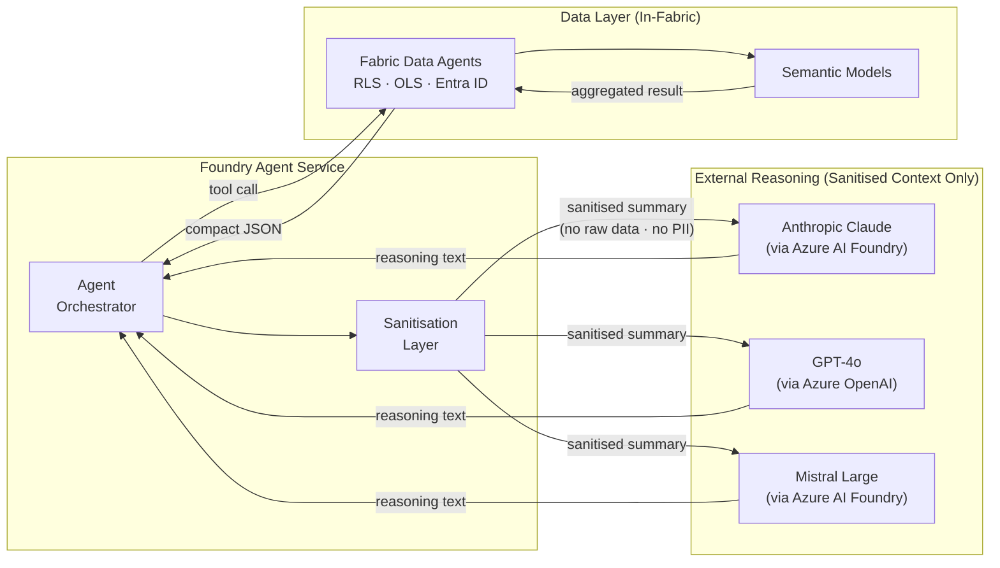

# External Reasoning Models

In the Foundry Agent Service architecture, external reasoning models — Anthropic Claude, GPT-4o, Mistral, and others — act as **stateless text engines**. They receive a system policy prompt plus a compact, sanitised summary produced by the Foundry Agent from Data Agent results. They return reasoning text only. They never touch Fabric, never see raw enterprise data, and have no persistent state between sessions.

!!! info "Where Reasoning Models Fit"
    External models are the **reasoning backend** configured in Foundry Agent Service. They are not APIM backends, not Data Agent endpoints, and not direct consumers of Fabric data. All data access happens through [Fabric Data Agents](data-agents.md); the reasoning model only sees what the Foundry Agent explicitly passes after sanitisation.

---

## Role of External Models in the Foundry Architecture



The **choice of reasoning model** does not change the security boundary. Whether Claude or GPT-4o is used, the sanitisation contract is identical: the model receives only what the Foundry Agent passes, and that is always a compact summary — never raw rows, customer identifiers, or free-text fields from production systems.

---

## Supported Models via Foundry Agent Service

All models below are available as reasoning backends in Foundry Agent Service. Configure the active model in the Foundry Agent's deployment settings — switching models requires no changes to Data Agents, APIM policies, or application code.

| Model | Provider | Context | Reasoning Quality | $/1K reasoning calls* | Zero Data Retention |
|-------|----------|---------|------------------|-----------------------|---------------------|
| **Claude 3.5 Sonnet** | Anthropic (Azure AI Foundry) | 200K | Excellent | ~$0.014 | Configurable — confirm in DPA |
| **Claude 3.5 Haiku** | Anthropic (Azure AI Foundry) | 200K | Very Good | ~$0.004 | Configurable — confirm in DPA |
| **GPT-4o** | Azure OpenAI | 128K | Excellent | ~$0.011 | Yes — Microsoft DPA |
| **GPT-4o-mini** | Azure OpenAI | 128K | Good | ~$0.001 | Yes — Microsoft DPA |
| **Mistral Large 2** | Mistral (Azure AI Foundry) | 128K | Good | ~$0.009 | Confirm per Azure AI Foundry terms |
| **Mistral Small 3** | Mistral (Azure AI Foundry) | 128K | Fair | ~$0.001 | Confirm per Azure AI Foundry terms |

*$/1K reasoning calls based on MKC's ~3,350 token average per query (2,000 system + 500 summary + 850 output). Prices East US, March 2026. See [Cost Scenarios](cost-scenarios.md) for full projections.

!!! tip "MKC Default: GPT-4o or Claude 3.5 Sonnet"
    Both GPT-4o and Claude 3.5 Sonnet deliver excellent narrative reasoning quality on aggregated business metrics. GPT-4o has a confirmed Microsoft DPA with no training on customer prompts. Claude 3.5 Sonnet requires explicit zero data retention configuration in the Anthropic Enterprise Agreement before use with any MKC-derived summaries. Start with GPT-4o; evaluate Claude 3.5 Sonnet on synthetic data before switching.

---

## What the Reasoning Model Receives — Sanitisation Pattern

This is the most critical control in the architecture. The Foundry Agent's tool implementation is responsible for transforming Data Agent results into a safe summary before any external model sees them.

=== "What Goes In (Safe)"

    ```
    System policy:
    "You are an AI assistant for MKC. You must never expose raw data rows or identifiers.
     Provide insights and recommendations based solely on the aggregated summary below."

    User prompt:
    "Data context (aggregated, no PII):
     Grain sales Nov-25 summary (3 locations, RLS applied):
       Salina: $1.24M revenue, 87,500 bu, +8.2% YoY
       Hutchinson: $0.98M revenue, 69,000 bu, −2.1% YoY
       McPherson: $0.76M revenue, 53,400 bu, +4.5% YoY
     Total: $2.98M | RLS enforced — user sees permitted locations only.

     User question: Compare Q4 revenue by region and suggest actions."
    ```

    ✓ Aggregated totals and percentages only
    ✓ No transaction IDs, customer names, producer IDs, or contact fields
    ✓ Explicit RLS confirmation in the context
    ✓ System policy instructs against data memorisation

=== "What Must Never Go In (Unsafe)"

    ```
    # NEVER send raw Data Agent rows to a reasoning model:
    {
      "rows": [
        {"transaction_id": "T-00182", "customer_id": "C001",
         "customer_name": "Smith Farms", "date": "2025-11-03",
         "location": "Salina", "bushels": 2400, "price": 14.20, "amount": 34080},
        ...
      ]
    }
    ```

    ✗ Contains `transaction_id`, `customer_id`, `customer_name` — PII and business identifiers
    ✗ Row-level data that could be memorised, leaked, or reconstructed
    ✗ Violates the sanitisation contract between Foundry Agent and external models

### Sanitisation Code (Foundry Tool Implementation)

```python
from typing import Any

# Columns safe to include in a reasoning model prompt
REASONING_SAFE_COLUMNS = {
    "fiscal_period", "calendar_month_name", "region", "division",
    "location_name", "commodity_type", "total_revenue_usd",
    "total_bushels", "margin_pct", "yoy_change_pct", "budget_variance_pct"
}

def build_reasoning_context(
    data_agent_result: dict[str, Any],
    max_rows: int = 20
) -> str:
    """
    Transform a Data Agent JSON result into a compact, sanitised string
    safe to include in a reasoning model prompt.

    Rules:
    - Only include columns from REASONING_SAFE_COLUMNS
    - Cap at max_rows aggregated records
    - Never include transaction IDs, customer IDs, names, or free-text fields
    """
    rows = data_agent_result.get("rows", [])
    meta = data_agent_result.get("meta", {})

    safe_rows = [
        {k: v for k, v in row.items() if k in REASONING_SAFE_COLUMNS}
        for row in rows[:max_rows]
    ]

    lines = [
        f"Data summary — {meta.get('query_description', 'MKC data')}",
        f"({len(rows)} records; showing {len(safe_rows)}; RLS applied: {meta.get('rls_applied', True)})",
        ""
    ]
    for row in safe_rows:
        lines.append("  " + " | ".join(f"{k}: {v}" for k, v in row.items()))

    if len(rows) > max_rows:
        lines.append(f"  ... {len(rows) - max_rows} additional records not shown (aggregated above)")

    return "\n".join(lines)
```

---

## Provider Data Controls

Before using any external reasoning model with MKC-derived data summaries, confirm the following controls are in place.

### Anthropic Claude via Azure AI Foundry

!!! warning "Zero Data Retention — Must Be Explicitly Configured"
    Anthropic offers zero data retention (ZDR) as a configurable enterprise term — it is **not enabled by default**. Zero data retention means Anthropic does not store or log prompt/completion content. This must be confirmed in writing in the Anthropic Enterprise Agreement **before** any MKC data summaries are sent to Claude.

| Control | Status | Action Required |
|---------|--------|-----------------|
| Zero data retention | Optional — off by default | Enable in Anthropic Enterprise Agreement |
| Independent processor terms | Available in enterprise DPA | Review and sign before production |
| No training on customer prompts | Available with enterprise ZDR | Confirm in writing |
| Azure-native endpoint | Yes — via Azure AI Foundry | No additional config |
| Network path | Azure-managed (in-tenant endpoint) | No public internet for API calls |

### GPT-4o via Azure OpenAI

| Control | Status | Action Required |
|---------|--------|-----------------|
| No training on customer prompts | Confirmed — Microsoft DPA | None — covered by existing Azure agreement |
| Data residency | East US (or configure EU region) | Confirm region matches MKC data classification policy |
| Private Endpoint | Available | Optional — configure for Confidential data workloads |
| Audit trail | Azure Monitor + Foundry logging | Enabled by default |

### Mistral via Azure AI Foundry

| Control | Status | Action Required |
|---------|--------|-----------------|
| No training on customer prompts | Covered by Azure AI Foundry terms | Review Azure AI Foundry DPA addendum |
| Data residency | Azure region where Foundry project is deployed | Match to MKC Azure subscription region |
| Network path | Azure AI Foundry in-tenant endpoint | No external API key required |

### DPA Checklist Before Production

Before routing any MKC Semantic Model–derived data (even aggregated) to an external reasoning model:

- [ ] Provider Data Protection Addendum reviewed and signed
- [ ] Zero data retention confirmed in writing (Anthropic) or equivalent confirmed (others)
- [ ] No model training on customer data confirmed
- [ ] CISO sign-off obtained for the data classification level of summaries being sent
- [ ] Foundry Agent logging enabled (all prompts and completions retained in MKC's own Log Analytics)
- [ ] Sanitisation function reviewed to confirm no PII or identifiers escape to the reasoning prompt

---

## Model Selection for Reasoning Tasks

In the Foundry Agent architecture, external models are used for **narrative reasoning** — not for NL→DAX translation (that is handled by the Data Agent inside Fabric). Choose a reasoning model based on the quality of insight synthesis, not DAX generation capability.

| Task | Recommended Model | Rationale |
|------|------------------|-----------|
| Narrative insight on aggregated metrics | Claude 3.5 Sonnet or GPT-4o | Excellent contextual reasoning; strong at "suggest actions" style prompts |
| High-volume daily summaries (cost-sensitive) | Claude 3.5 Haiku or GPT-4o-mini | 3–10× cheaper; adequate for structured "here are the numbers, format as a summary" tasks |
| Complex multi-step analysis (compliance, audit) | GPT-4o or Claude 3.5 Sonnet | Better at following strict policy constraints in multi-turn reasoning |
| Low-latency responses (real-time dashboards) | GPT-4o-mini or Mistral Small | Faster p50 latency; acceptable quality for brief summaries |

!!! info "NL→DAX Is Not the Reasoning Model's Job"
    In this architecture, the reasoning model never generates DAX. DAX generation happens inside the Data Agent (which has the Semantic Model schema context). The reasoning model only receives a text summary and produces a text response. This simplifies model selection — almost any model can summarise "Revenue in North was $2.1M, up 12% YoY" into business language.

---

## References

| Resource | Description |
|----------|-------------|
| [Foundry Agent Service Architecture](llm-architecture.md) | Full architecture — how Foundry orchestrates tool calls, sanitisation, and reasoning model invocation |
| [Fabric Data Agents](data-agents.md) | Data Agent tool configuration, result schema, and aggregation guidelines |
| [Microsoft Foundry Agent Service](https://learn.microsoft.com/en-us/azure/ai-foundry/concepts/agent-service) | Foundry reasoning backend configuration, model selection, and built-in logging |
| [Azure AI Foundry model catalog](https://learn.microsoft.com/en-us/azure/ai-foundry/concepts/foundry-models-overview) | Claude, Mistral, Meta, Cohere as serverless Foundry reasoning backends |
| [Anthropic Enterprise Data Protection](https://www.anthropic.com/legal/commercial-terms) | Zero data retention terms and independent processor DPA for Claude |
| [Claude model overview](https://docs.anthropic.com/en/docs/about-claude/models/overview) | Claude 3.5 Sonnet vs. Haiku — context window, pricing, reasoning capability notes |
| [Azure OpenAI data privacy](https://learn.microsoft.com/en-us/legal/cognitive-services/openai/data-privacy) | Microsoft's confirmation of no training on customer prompts via Azure OpenAI |
| [Cost Scenarios](cost-scenarios.md) | MKC token cost projections — baseline for reasoning model cost comparisons |
| [Azure OpenAI Integration](azure-openai-integration.md) | GPT model catalogue and full pricing table for reasoning backend sizing |
