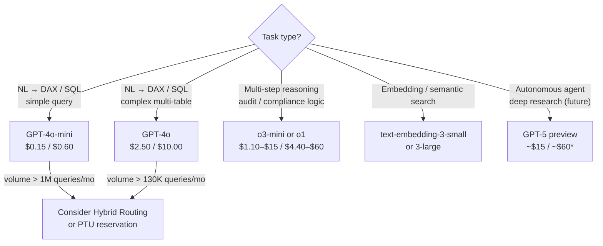
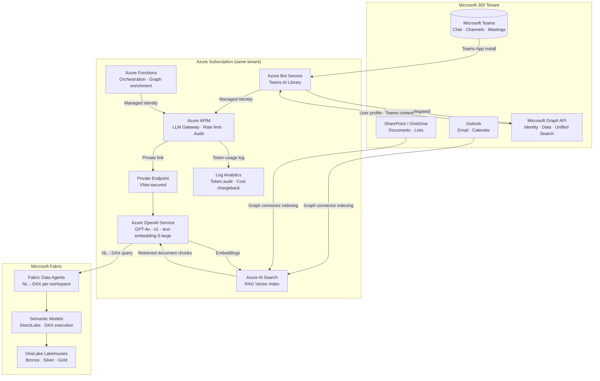
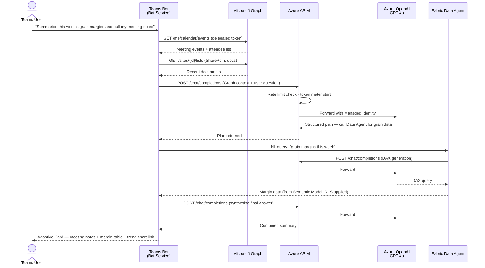
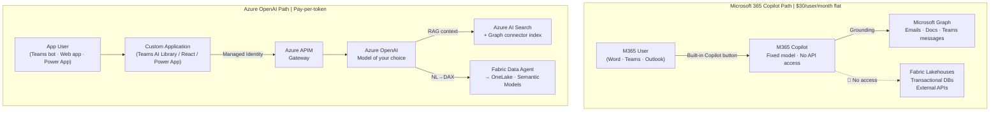
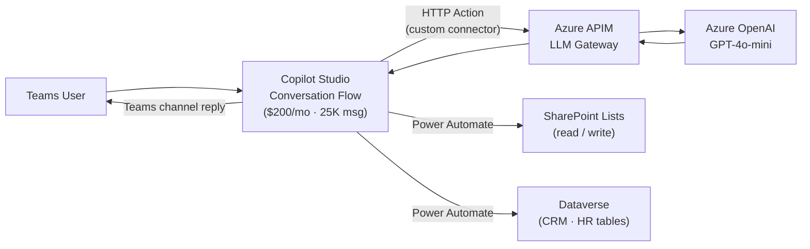

# Azure OpenAI Integration

## Overview

Azure OpenAI Service is the enterprise API layer that powers MKC's AI platform — from Fabric Data Agents to custom Teams bots and Power Platform automation. This page covers the full model catalogue and pricing, contrasts Azure OpenAI with Microsoft 365 Copilot (and why they cannot be interchanged), and shows concrete deployment patterns for Teams, Power Platform, and Microsoft Graph integrations.

---

!!! info "Foundry Agent Service Architecture"
    In the current architecture, GPT models are accessed as **reasoning backends** configured in Foundry Agent Service — not called directly by Data Agents or APIM. The model catalogue and pricing on this page remain valid for sizing reasoning backend costs. See [Foundry Agent Service Architecture](llm-architecture.md) for the full deployment pattern, including how GPT-4o fits alongside Anthropic Claude and Mistral as interchangeable reasoning models.

---

## Model Catalogue & Pricing

All models below are available through **Azure OpenAI Service** in the East US region. Pricing is per million tokens (input / output separately billed).

### GPT-4 Family

| Model | Azure Deployment Name | Input $/1M | Output $/1M | Context | Best For |
|-------|-----------------------|-----------|------------|---------|---------|
| **GPT-4o** | `gpt-4o` | $2.50 | $10.00 | 128K | Complex multi-table NL→DAX, reasoning |
| **GPT-4o-mini** | `gpt-4o-mini` | $0.15 | $0.60 | 128K | Simple lookups, classification, high-volume |
| GPT-4 Turbo | `gpt-4` (`1106-preview`) | $10.00 | $30.00 | 128K | Legacy; superseded by GPT-4o at lower cost |
| GPT-4 (0613) | `gpt-4` (`0613`) | $30.00 | $60.00 | 8K | Legacy; being deprecated — avoid for new work |

!!! warning "GPT-4 (0613) Deprecation"
    Microsoft is retiring GPT-4 (0613) deployments. Migrate existing workloads to **GPT-4o** which delivers better quality at 12× lower cost.

### Reasoning Models (o-series)

| Model | Input $/1M | Output $/1M | Context | Best For |
|-------|-----------|------------|---------|---------|
| **o1** | $15.00 | $60.00 | 200K | Multi-step planning, complex code generation, audit logic |
| **o3-mini** | $1.10 | $4.40 | 200K | Cost-efficient reasoning for structured tasks and data validation |

!!! info "When to Use Reasoning Models"
    o-series models use chain-of-thought internally before responding. They are significantly slower than GPT-4o but excel at tasks requiring verifiable logical steps — e.g. compliance rule checking, financial reconciliation logic, or generating complex multi-join DAX. For NL→DAX at MKC's current query complexity, GPT-4o remains the better default.

### GPT-5 (Preview, Early 2026)

!!! warning "GPT-5 — Verify Pricing Before Committing"
    GPT-5 entered Azure OpenAI preview in early 2026. Prices below are indicative estimates based on early announcements. Confirm at the [Azure OpenAI pricing page](https://azure.microsoft.com/pricing/details/cognitive-services/openai-service/) before building cost models around this model.

| Model | Input $/1M | Output $/1M | Context | Best For |
|-------|-----------|------------|---------|---------|
| **GPT-5** | ~$15.00* | ~$60.00* | 256K+ | Most complex autonomous agent tasks, deep research, multi-document synthesis |
| **GPT-5-mini** | ~$1.50* | ~$6.00* | 128K | Balanced cost/quality for production workloads at scale |

*Estimated — confirm at GA before using in budget projections.

### Embedding Models

| Model | Price $/1M tokens | Dimensions | Best For |
|-------|------------------|-----------|---------|
| text-embedding-3-large | $0.13 | 3,072 | Semantic search, RAG pipelines, high-accuracy retrieval |
| text-embedding-3-small | $0.02 | 1,536 | High-volume embedding, cost-sensitive workloads |

> All prices East US region, March 2026. See [Cost Scenarios](cost-scenarios.md) for full MKC usage projections.

### Model Selection Decision Tree



---

## Microsoft 365 Copilot vs. Azure OpenAI Service

These are two **entirely separate Microsoft AI offerings** operating at different layers of the Microsoft stack. A frequent misconception is that they are interchangeable or can be directly connected — they cannot.

### What Each Is

| | Microsoft 365 Copilot | Azure OpenAI Service |
|--|----------------------|---------------------|
| **Layer** | Microsoft 365 SaaS product | Azure cloud API (PaaS) |
| **Access model** | Per-seat licence; enabled by IT admin | REST API / SDK; accessed via application code |
| **Data grounding** | Microsoft Graph only — emails, Teams messages, SharePoint, OneDrive, Calendar | Any data you connect: Fabric, SQL, APIs, documents, custom databases |
| **Underlying model** | Microsoft-managed GPT-4 class; **not user-selectable** | You choose: GPT-4o, GPT-4o-mini, o1, GPT-5, etc. |
| **Customisation** | System prompt via Copilot Studio only; model is fixed | Full control: system prompt, temperature, functions, RAG, fine-tuning |
| **Who builds with it** | End users + low-code IT (Copilot Studio) | Developers via REST API / Python / Node.js SDK |
| **UI surfaces** | Word, Excel, Teams, Outlook, PowerPoint, Loop | Any UI you build: Teams bot, web app, Power App, API |

### Why They Cannot Be Directly Integrated

!!! danger "Architecture Boundary — Not a Configuration Issue"
    Microsoft 365 Copilot runs on **Microsoft's proprietary managed LLM infrastructure**. There is no API, configuration flag, or administrative setting that lets you substitute your Azure OpenAI deployment as the engine, inject prompts into Copilot's reasoning, or read Copilot conversation transcripts programmatically from outside M365.

There are three root causes:

**1. Separate data planes**

M365 Copilot operates exclusively within the Microsoft 365 compliance boundary, grounded against Microsoft Graph data. Your Azure OpenAI resource sits in a separate Azure subscription resource group with its own network boundary (Private Endpoint, VNet). There is no native bridge between these two planes — Graph data does not flow into Azure OpenAI automatically, and Azure OpenAI responses cannot be injected into Copilot's context.

**2. Authentication model mismatch**

M365 Copilot authenticates via Microsoft Graph OAuth 2.0 delegated permissions. Azure OpenAI authenticates via Azure RBAC and Managed Identity (or API key). These identity systems are not interoperable at the data-plane level — a Graph delegated token cannot call the Azure OpenAI endpoint, and an Azure Managed Identity cannot read Graph mailbox data without a separate Graph API call with its own consent flow.

**3. The model is not user-selectable**

Microsoft operates the model that powers M365 Copilot on infrastructure it manages internally. You cannot replace it with, redirect it to, or augment it from your Azure OpenAI Service resource. Microsoft may update the underlying model version at any time without notice or opt-out.

**Available bridge points (limited):**

| Bridge | What it Does | Limitation |
|--------|-------------|-----------|
| **Copilot Studio HTTP connector** | Calls Azure OpenAI REST API as a custom action within a Copilot Studio agent | Adds ~500ms latency per hop; Copilot Studio session billed separately |
| **Microsoft Graph connectors** | Indexes external data *into* M365 Copilot's grounding corpus | Ingestion only, not real-time; cannot ground against live Fabric query results |
| **Teams AI Library custom bot** | Builds a separate AI app that *appears alongside* Copilot in Teams | Completely separate bot — not the same as Copilot; no Copilot context shared |
| **Declarative Agents (Copilot Studio)** | Extends M365 Copilot with scoped instructions + Graph connector data | Cannot use Azure OpenAI as the inference engine; model is still M365-managed |

### Billing Comparison

=== "Microsoft 365 Copilot"

    | Item | Price | Notes |
    |------|-------|-------|
    | **M365 licence prerequisite** | $22–$36/user/month | E3 or E5 licence required before Copilot can be assigned |
    | **Microsoft 365 Copilot add-on** | **$30/user/month** | Flat per-seat; usage is unlimited within Microsoft 365 surfaces |
    | **Minimum commitment** | Annual (12 months) | No monthly billing; no per-query pricing |
    | **Copilot Studio (optional)** | $200/tenant/month | Includes 25,000 messages/month; $0.01/message beyond |
    | **Microsoft Graph connectors** | First 500 items/month free | $0.00 per item ingested beyond free tier (via M365 add-on quota) |

    **Cost for 150 MKC users:** ~$4,500/month (Copilot add-on alone, before M365 base licences)

    > Token consumption is invisible and unlimited — included in the flat per-seat fee. You cannot see how many tokens each user consumes.

=== "Azure OpenAI Service"

    | Item | Price | Notes |
    |------|-------|-------|
    | **Model tokens (GPT-4o)** | $2.50 / $10.00 per 1M | Variable — pay only for what is consumed |
    | **Model tokens (GPT-4o-mini)** | $0.15 / $0.60 per 1M | 16× cheaper than GPT-4o for simple queries |
    | **Azure APIM gateway** | ~$3–$50/month | Scales with call volume; negligible at pilot scale |
    | **Private Endpoint** | ~$7.30/month | Fixed network isolation cost |
    | **App Service / Bot hosting** | ~$50–$200/month | For Teams bot or web application hosting |
    | **Log Analytics** | ~$2.30/GB ingested | Full token audit trail |

    **Cost for 150 MKC users (GPT-4o):** ~$510–$750/month total (tokens + infrastructure)

    > 6–9× cheaper than M365 Copilot at the same user count for data querying use cases. Cost scales with usage, not headcount.

### Pros and Cons

| | Microsoft 365 Copilot | Azure OpenAI Service |
|--|----------------------|---------------------|
| **Pros** | Zero development effort — works in Word, Excel, Teams, Outlook immediately | Full model choice: GPT-4o-mini for cost, o1 for reasoning, GPT-5 for agents |
| | Automatically grounded on existing M365 content (emails, Teams history, SharePoint docs) | Pay per use — scales down to zero when idle; 6–9× cheaper at MKC's scale |
| | IT-managed; no developers or infrastructure required | Grounds against any data: Fabric Lakehouses, transactional databases, external APIs |
| | Microsoft handles model versioning, safety filtering, compliance | Fine-tuning and RAG on MKC proprietary data (e.g. grain pricing history, agronomy data) |
| | Strong compliance posture within M365 boundary (Purview audit trail) | Full prompt and token audit visibility via APIM + Log Analytics |
| **Cons** | **$30/user/month flat — $4,500/month for 150 users regardless of usage** | Requires developer effort to build, test, and maintain applications |
| | Model is fixed — no GPT-4o-mini, no reasoning models, no fine-tuning option | UI must be built (Teams bot, web app, Power App) — not built-in to Office apps |
| | Cannot ground against Fabric Lakehouses, transactional databases, or real-time data | Content safety policies must be configured and tested explicitly |
| | No programmatic API to query, extend, or audit Copilot reasoning | APIM, Private Endpoint, Managed Identity infrastructure setup required |
| | Annual licence commitment — no usage-based scaling | Token cost grows linearly with query volume (predictable but not free) |
| **Best for** | Knowledge workers needing document/email summarisation, meeting notes, drafting | Data-driven AI: NL→DAX/SQL, operational queries, custom automation, agent workflows |

!!! tip "MKC Recommendation"
    For MKC's primary use case — **structured data querying against Fabric semantic models** — Azure OpenAI Service is the right platform. M365 Copilot does not ground against OneLake data and would cost ~$4,500/month for 150 users for capabilities that don't align with MKC's core need.

    If MKC already holds M365 E5 licences, evaluate Copilot as an **incremental addition** for knowledge worker use cases (meeting summarisation, email drafting, document Q&A) — not as a replacement for the data agent platform.

---

## Deployment Patterns

### Teams Integration

Three distinct approaches to surface Azure OpenAI inside Microsoft Teams, ordered by engineering complexity:

=== "Teams AI Library — Custom Bot (Recommended)"

    The **Teams AI Library** (Node.js or C#) is Microsoft's recommended SDK for building AI-native Teams applications. It wraps the Bot Framework with Teams-specific abstractions and built-in Azure OpenAI integration.

    **Architecture:**

    ```mermaid
    flowchart LR
        TU["Teams User<br/>(Chat / Channel)"]
        Bot["Azure Bot Service<br/>Teams AI Library SDK"]
        APIM["Azure APIM<br/>LLM Gateway"]
        AOAI["Azure OpenAI<br/>GPT-4o"]
        Graph["Microsoft Graph<br/>User profile · Calendar · Teams context"]
        Storage["Azure Storage<br/>Conversation history"]

        TU -->|"Chat message"| Bot
        Bot -->|"Graph token (delegated)"| Graph
        Graph -->|"User data + Teams context"| Bot
        Bot -->|"Managed Identity"| APIM
        APIM --> AOAI
        AOAI -->|"Response"| APIM
        APIM -->|"Response"| Bot
        Bot -->|"Read / write history"| Storage
        Bot -->|"Adaptive Card reply"| TU
    ```

    **Capabilities:**

    - Adaptive Cards for rich responses (tables, charts, action buttons)
    - Persistent conversation history (Azure Storage or CosmosDB)
    - Proactive notifications — push messages to users without a prompt
    - Tab apps — full embedded web application inside Teams
    - Full access to Teams context: user UPN, channel ID, meeting metadata via Graph API

    **Setup steps:**

    1. Register a Bot in **Azure Bot Service** (free tier sufficient for development)
    2. Create a Teams App manifest in **Teams Developer Portal**
    3. Scaffold project with **Teams Toolkit** (VS Code extension)
    4. Configure Azure OpenAI APIM endpoint in app settings (Managed Identity — no key in code)
    5. Deploy to **Azure App Service** or **Azure Container Apps**
    6. Publish to **Teams Admin Centre** for org-wide installation

    ```python
    # teams_bot.py — simplified Teams AI Library pattern (Python equivalent)
    from botbuilder.core import TurnContext, ActivityHandler
    from openai import AzureOpenAI

    client = AzureOpenAI(
        azure_endpoint=os.environ["APIM_ENDPOINT"],
        azure_ad_token_provider=get_bearer_token_provider(
            DefaultAzureCredential(), "https://cognitiveservices.azure.com/.default"
        ),
        api_version="2024-02-01"
    )

    class MKCBot(ActivityHandler):
        async def on_message_activity(self, turn_context: TurnContext):
            user_question = turn_context.activity.text
            response = client.chat.completions.create(
                model="gpt-4o",
                messages=[
                    {"role": "system", "content": SYSTEM_PROMPT},
                    {"role": "user", "content": user_question}
                ]
            )
            await turn_context.send_activity(response.choices[0].message.content)
    ```

=== "Copilot Studio — Low-code (IT-managed)"

    **Copilot Studio** (formerly Power Virtual Agents) lets IT administrators build Teams-deployable agents with no code. Azure OpenAI is connected as an **HTTP connector action**.

    ```mermaid
    flowchart LR
        TU["Teams User"] -->|"Teams channel"| CS["Copilot Studio<br/>Conversation Flow"]
        CS -->|"HTTP Action<br/>(custom connector)"| APIM["Azure APIM"]
        APIM --> AOAI["Azure OpenAI<br/>GPT-4o-mini"]
        AOAI --> APIM --> CS
        CS -->|"Power Automate flow"| SP["SharePoint Lists"]
        CS -->|"Power Automate flow"| DV["Dataverse Tables"]
        CS -->|"Reply"| TU
    ```

    **Capabilities:**
    - No-code conversation flows with branching logic
    - Built-in Teams channel deployment (one-click)
    - Power Automate integration for backend data operations
    - Azure OpenAI callable via HTTP connector (REST POST)

    **Limitations:**
    - Copilot Studio sessions billed separately at $200/month for 25K messages
    - HTTP connector adds ~500ms latency per Azure OpenAI call
    - Limited control over prompt engineering compared to SDK integration

    **Best for:** HR FAQ bots, helpdesk agents, onboarding flows — scenarios where IT controls the flow without developer involvement.

=== "Bot Framework SDK — Multi-channel"

    The **Bot Framework SDK** (v4, C# or Node.js) is the lower-level predecessor to Teams AI Library. Use it when the bot must serve **multiple channels** beyond Teams (WebChat, Slack, email via Azure Communication Services).

    **When to use:**
    - Bot must serve Teams + a public web chat widget simultaneously
    - Existing Bot Framework codebase in the organisation
    - Complex middleware pipeline needed (custom auth handlers, response transformers)

    **Teams AI Library is preferred** for Teams-only deployments — it provides a higher-level abstraction with less boilerplate.

### Power Platform Integration

| App | Integration Method | Use Case | Billing Notes |
|-----|-------------------|---------|--------------|
| **Power Automate** | Built-in Azure OpenAI connector | Document summarisation, email classification, data enrichment flows | Standard connector: 500 calls/month free; $0.01/call beyond |
| **Power Apps** | Azure Custom Connector or Power Automate flow | AI-enriched forms — describe a field in NL, receive structured output | Custom connector calls count against Power Platform API limits |
| **Power BI** | Fabric Data Agent (APIM → AOAI) or Fabric Copilot | NL→DAX embedded in reports, Q&A visual replacement | Fabric Copilot requires F64+; Data Agent works on any SKU |
| **Logic Apps** | HTTP action or Azure OpenAI connector | Backend API orchestration, batch document processing | Standard Logic App: ~$0.000025/action |
| **SharePoint** | Power Automate trigger on library changes | Auto-summarise new documents added to a library | Power Automate Standard licence required |

---

## Integration Architecture Diagrams

### Full Microsoft 365 + Azure OpenAI Platform



### Teams Bot with Graph Enrichment — Sequence



### M365 Copilot vs. Azure OpenAI — Architecture Comparison



### Copilot Studio Connector to Azure OpenAI



---

## Security & Governance

| Concern | M365 Copilot | Azure OpenAI Custom App |
|---------|-------------|------------------------|
| **Data residency** | M365 compliance boundary (same as tenant) | Azure region you select (e.g. East US, West Europe) |
| **Prompt visibility** | Microsoft-managed; no programmatic access | Full prompt/response log via APIM → Log Analytics |
| **Token audit** | Invisible — not exposed to tenant admin | Per-workspace token chargeback via APIM policy |
| **Content filtering** | Microsoft-managed Azure AI Content Safety (no config) | Configurable per deployment in APIM policy + Azure AI Content Safety API |
| **Identity** | Delegated user identity (Graph OAuth) | Managed Identity (service) + Azure RBAC |
| **Audit trail** | M365 Compliance Centre (Microsoft Purview) | APIM audit log + Azure Monitor + custom Log Analytics queries |
| **Network isolation** | M365 trust boundary (not configurable) | Private Endpoint + VNet — traffic stays on Microsoft backbone |

---

## Further Reading

| Topic | Page |
|-------|------|
| APIM gateway configuration and token quota policies | [Enterprise LLM Architecture](llm-architecture.md) |
| NL→DAX agents per workspace group | [Fabric Data Agents](data-agents.md) |
| Full cost model: Fabric F-SKU + AOAI tokens | [Cost Scenarios](cost-scenarios.md) |
| Fabric Copilot (F64+ built-in) vs. custom agents | [Enterprise LLM Architecture](llm-architecture.md) |

---

## References

| Resource | Description |
|----------|-------------|
| [Azure OpenAI Service pricing](https://azure.microsoft.com/en-us/pricing/details/cognitive-services/openai-service/) | Per-token pricing for GPT-4o, o1, GPT-5, and embedding models by region |
| [Azure OpenAI model availability](https://learn.microsoft.com/en-us/azure/ai-services/openai/concepts/models) | Supported models, deployment regions, and context window sizes |
| [Microsoft Teams AI Library](https://learn.microsoft.com/en-us/microsoftteams/platform/bots/how-to/teams-ai-library) | SDK for building AI-native Teams bots with Azure OpenAI integration |
| [Microsoft Copilot Studio](https://learn.microsoft.com/en-us/microsoft-copilot-studio/fundamentals-what-is-copilot-studio) | Low-code agent builder with Teams channel deployment and HTTP connector |
| [Microsoft Graph overview](https://learn.microsoft.com/en-us/graph/overview) | Unified API for Microsoft 365 data: emails, Teams messages, Calendar, SharePoint |
| [Microsoft 365 Copilot documentation](https://learn.microsoft.com/en-us/microsoft-365-copilot/microsoft-365-copilot-overview) | M365 Copilot capabilities, licensing, and data grounding via Microsoft Graph |
| [Azure Bot Service documentation](https://learn.microsoft.com/en-us/azure/bot-service/bot-service-overview) | Bot registration, Teams channel configuration, and Bot Framework SDK |
| [Power Automate Azure OpenAI connector](https://learn.microsoft.com/en-us/connectors/cognitiveservicesopenai/) | Built-in Power Automate connector for Azure OpenAI API calls |
