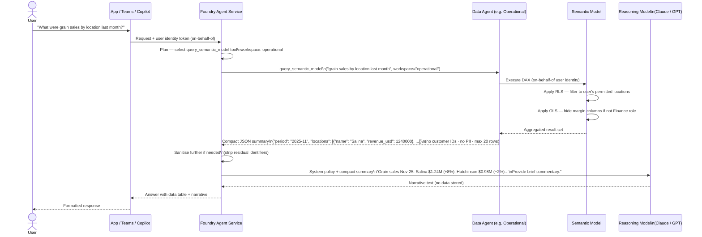

# Fabric Data Agents

## What Are Fabric Data Agents?

Fabric Data Agents are **tool functions registered in the Foundry Agent Service** — the only authorised gateway between the AI platform and Fabric Semantic Models. Each Data Agent:

1. Receives a `query_semantic_model` tool call from the Foundry Agent (with a natural-language question and workspace target)
2. Translates the question to a DAX or SQL query using the Semantic Model's schema
3. Executes that query against the Semantic Model **under the user's own Entra identity** (via on-behalf-of flow)
4. Returns a **compact, aggregated JSON summary** — not raw row-level data — to the Foundry Agent

The Foundry Agent then includes this summary (sanitised further if needed) in its prompt to the external reasoning model (Claude, GPT, etc.) for narrative analysis. External models never call Fabric directly.

!!! info "Key Architecture Rule"
    Data Agents are the **only** component authorised to query Fabric Semantic Models. The reasoning model (Claude, GPT) receives only what the Foundry Agent explicitly passes — a compact summary with no raw rows, PII, or identifiers. See [Foundry Agent Service Architecture](llm-architecture.md) for the full data flow and leakage prevention controls.

!!! info "Key Security Property"
    Because the DAX/SQL is executed under the **user's own identity** (on-behalf-of flow), all Row-Level Security and Object-Level Security rules apply automatically. A sales rep asking about margin by region will only see the regions they have access to — the agent cannot bypass RLS/OLS.

---

## Agent → Workspace → Semantic Model Mapping

| Agent | Workspace Group | Semantic Model(s) | Example NL Questions |
|-------|----------------|-------------------|---------------------|
| **Data Agent (Operational)** | Sales, OMS, Operations | Sales | *"What were grain sales in Q3 by location?"* |
| **Data Agent (Analytics)** | Executive, Data Portal | Sales + Financial + Operations | *"Show margin trend vs budget by division this fiscal year"* |
| **Data Agent (Financial)** | Financial Reporting, Financial Processing | Financial | *"Which AP invoices are overdue by cost center?"* |
| **Data Agent (Domain)** | Administration, Producer Ag, HR, Digital Transformation | Financial + Operations | *"What fields are enrolled per producer this planting season?"* |

---

## Query Flow — Data Agent as a Foundry Tool



---

## What Data Agents Return

Data Agents should return **aggregated, calculated results** — not raw row-level exports. This keeps the data summary safe to pass to an external reasoning model.

=== "Good — Aggregated Summary"

    ```json
    {
      "query": "grain sales by location Nov-25",
      "period": "2025-11",
      "locations": [
        {"location_name": "Salina",     "revenue_usd": 1240000, "bushels": 87500, "yoy_change_pct": 8.2},
        {"location_name": "Hutchinson", "revenue_usd":  980000, "bushels": 69000, "yoy_change_pct": -2.1},
        {"location_name": "McPherson",  "revenue_usd":  760000, "bushels": 53400, "yoy_change_pct": 4.5}
      ],
      "total_revenue_usd": 2980000,
      "record_count": 3,
      "rls_applied": true
    }
    ```

    ✓ Aggregated by location — no individual transactions
    ✓ No customer names, IDs, or contact fields
    ✓ Safe to include in a Foundry Agent prompt to Claude/GPT

=== "Bad — Raw Row Export"

    ```json
    {
      "rows": [
        {"transaction_id": "T-00182", "customer_id": "C001", "customer_name": "Smith Farms",
         "date": "2025-11-03", "location": "Salina", "bushels": 2400, "price": 14.20, "amount": 34080},
        {"transaction_id": "T-00183", "customer_id": "C002", "customer_name": "Johnson Grain LLC",
         "date": "2025-11-03", "location": "Salina", "bushels": 1800, "price": 14.15, "amount": 25470},
        ...
      ]
    }
    ```

    ✗ Raw transaction rows — should never leave Data Agent
    ✗ Contains customer names and IDs
    ✗ Must NOT be sent to an external reasoning model

---

## System Prompt Structure

Each Data Agent is pre-configured with a system prompt containing schema context and DAX generation rules. This prompt is used internally by the Data Agent to translate natural-language questions to DAX — it is separate from (and never shared with) the reasoning model prompt.

```
You are a data analyst tool for MKC (Mid-Kansas Cooperative).
You have access to the Sales semantic model which contains:

TABLES:
- FactGrainSales (transaction_id, date_key, location_key, item_key,
                  customer_key, quantity_bushels, price_per_bushel, amount_usd)
- DimDate (date_key, full_date, fiscal_period, fiscal_year, calendar_month_name)
- DimLocation (location_key, location_name, region, division)
- DimItem (item_key, description, commodity_type)
- DimCustomer (customer_key, name, region)

MEASURES (pre-defined):
- [Total Grain Revenue], [Total Grain Bushels], [Grain Margin %]

RULES:
- Always use DAX, never SQL for this semantic model
- Use CALCULATE() with FILTER() for date ranges
- Use USERPRINCIPALNAME() for user-specific queries
- Return aggregated summaries only — do not return raw transaction rows
- Limit result to at most 20 location / dimension combinations

FEW-SHOT EXAMPLES:
Q: What were grain sales last month?
A: EVALUATE SUMMARIZECOLUMNS(DimDate[fiscal_period], "Sales", [Total Grain Revenue])
```

---

## Registering a Data Agent as a Foundry Tool

1. In the target BI workspace, create or confirm a **Data Agent** item (Fabric AI item type) connected to the workspace's Semantic Model
2. Configure the system prompt with table schema and few-shot DAX examples (as above)
3. Set the Data Agent to return aggregated results — configure max row limits in the agent's response settings
4. **Register the Data Agent as a tool in Foundry Agent Service** using the `query_semantic_model` function definition (see [Foundry Agent Service Architecture](llm-architecture.md) for the full tool schema)
5. In the Foundry Agent's tool implementation, wire `query_semantic_model` calls to the Data Agent's REST endpoint using a service principal with least-privilege permissions
6. Optionally route Data Agent calls through [APIM Position 2](llm-architecture.md#apim-two-optional-positions) to enforce per-session call quotas and response row limits at the gateway

!!! warning "Do Not Expose Data Agents Directly to Users"
    Data Agents are internal tools. They should only receive calls from the Foundry Agent Service (authenticated via Managed Identity or a registered service principal). Do not publish Data Agent endpoints publicly or wire them directly to user-facing apps — all user interaction goes through the Foundry Agent.

---

## Monitoring Agent Usage

All Data Agent tool calls can be traced through Foundry's built-in logging. If [APIM Position 2](llm-architecture.md#apim-two-optional-positions) is deployed, the APIM event log provides an additional per-tool-call audit stream:

```kusto
// Top 10 Data Agent questions by frequency (via APIM Position 2 log)
AzureDiagnostics
| where ResourceType == "APIMANAGEMENT"
| where OperationName == "query_semantic_model"
| extend SessionId   = tostring(requestBody_headers.x_agent_session_id)
| extend WorkspaceId = tostring(requestBody_headers.x_workspace_id)
| extend Question    = tostring(parse_json(tostring(requestBody_s))["question"])
| summarize QueryCount = count() by Question, WorkspaceId
| top 10 by QueryCount desc
```

```kusto
// Data Agent call volume and latency by workspace (daily)
AzureDiagnostics
| where ResourceType == "APIMANAGEMENT"
| where OperationName == "query_semantic_model"
| extend WorkspaceId  = tostring(requestBody_headers.x_workspace_id)
| extend DurationMs   = toint(DurationMs)
| summarize
    CallCount   = count(),
    P50_ms      = percentile(DurationMs, 50),
    P95_ms      = percentile(DurationMs, 95)
  by WorkspaceId, bin(TimeGenerated, 1d)
| order by TimeGenerated desc
```

---

## References

| Resource | Description |
|----------|-------------|
| [Fabric Data Agent overview](https://learn.microsoft.com/en-us/fabric/data-science/fabric-data-agent) | Creating and configuring natural-language query agents in Fabric workspaces |
| [Foundry Agent Service Architecture](llm-architecture.md) | Full system architecture — how Data Agents fit as tools within the Foundry orchestration layer |
| [On-behalf-of flow (Entra ID)](https://learn.microsoft.com/en-us/entra/identity-platform/v2-oauth2-on-behalf-of-flow) | Delegated identity chain enabling user-context RLS/OLS enforcement through the agent stack |
| [Row-Level Security in Power BI](https://learn.microsoft.com/en-us/power-bi/enterprise/service-admin-rls) | DAX role definitions and identity-based row filtering in Semantic Models |
| [External Reasoning Models](alternative-llm-providers.md) | How sanitised Data Agent results are passed to Claude/GPT for narrative analysis |
| [Azure API Management policies](https://learn.microsoft.com/en-us/azure/api-management/api-management-howto-policies) | APIM Position 2 — per-session tool call quotas and response transformation |
| [Log Analytics query language (KQL)](https://learn.microsoft.com/en-us/azure/data-explorer/kusto/query/) | Kusto query syntax for querying APIM tool-call usage logs |
