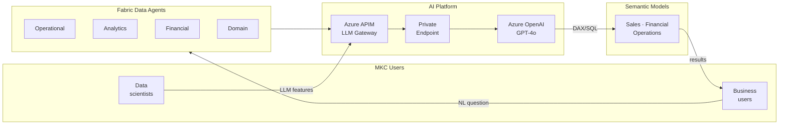

# AI, Data Science & MLOps

This section covers MKC's AI platform strategy, Data Agent deployment, and machine learning operations.

| Page | Description |
|------|-------------|
| [Foundry Agent Service Architecture](llm-architecture.md) | Target architecture — Foundry Agent as orchestrator, Data Agents as tools, external models as stateless reasoning engines, APIM in two optional positions |
| [Azure OpenAI Integration](azure-openai-integration.md) | Full model catalogue (GPT-4, GPT-4o, GPT-5), M365 Copilot vs. Azure OpenAI, Teams deployment patterns, Microsoft Graph integration diagrams |
| [Fabric Data Agents](data-agents.md) | Data Agents as Foundry tools — the only gateway to Semantic Models; RLS/OLS enforcement, aggregated return payloads, tool registration |
| [External Reasoning Models](alternative-llm-providers.md) | Claude, GPT, Mistral as Foundry reasoning backends — sanitisation pattern, provider data controls, DPA checklist, model selection |
| [MLOps Pipeline](mlops-pipeline.md) | ML Notebooks, MLflow experiment tracking, model registry, model serving |
| [Feature Store](feature-store.md) | Gold-layer Delta feature tables for ML training and inference |
| [Cost Scenarios](cost-scenarios.md) | Fabric F-SKU capacity costs vs. Azure OpenAI per-token costs — three scenarios |

## AI Platform Summary

