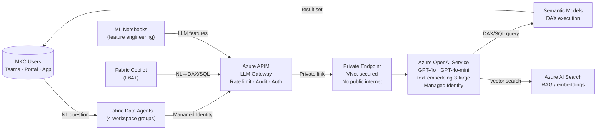

# Enterprise LLM Architecture

## Overview

MKC uses **Azure OpenAI Service** as its enterprise LLM platform — the only option that delivers GPT-4-class models entirely within the Microsoft tenant boundary with Private Endpoint network isolation and Managed Identity authentication.



## Why Azure OpenAI Service?

| Criterion | Azure OpenAI Service | Decision |
|-----------|---------------------|----------|
| **Data residency** | In-tenant; same Azure region as Fabric | MKC data never leaves the tenant boundary |
| **Authentication** | Managed Identity (no API keys in code) | Zero-secret auth; no key rotation risk |
| **Network security** | Private Endpoint + VNet integration | All traffic on Microsoft backbone; no public internet |
| **Compliance** | SOC2 Type II, HIPAA, ISO27001, GDPR | Meets agricultural co-op data handling requirements |
| **No model training on data** | Confirmed via Data Protection Addendum | Microsoft does not use customer prompts to train models |
| **Governance** | Azure APIM as LLM Gateway | Per-workspace token quotas, full audit log, chargeback by workspace |
| **Model availability** | GPT-4o, GPT-4o-mini, o1, o3-mini, GPT-5 (preview), text-embedding-3-large | State-of-the-art models with Microsoft SLA |
| **Alternatives considered** | Azure AI Foundry model hub, on-prem Ollama, public OpenAI API | Azure OpenAI wins on compliance + native Fabric/Entra integration |

## Security Architecture

```
Data Agent / Copilot / ML Notebook
    ↓ HTTPS (Managed Identity token)
Azure API Management (LLM Gateway)
    · Rate limit: 50,000 tokens/min per workspace
    · Authentication: Managed Identity token validation
    · Content filtering policies: enabled tenant-wide
    · Audit log → Log Analytics workspace (full token usage)
    ↓ Internal VNet (private link)
Private Endpoint (no public IP)
    ↓ Microsoft backbone network
Azure OpenAI Service
    · No public internet access
    · Content filters enabled
    · Customer data NOT used for training
    · GPT-4o, GPT-4o-mini, text-embedding-3-large deployed
```

## Deployment Model Options

| Model | Description | When to Use | Est. Token Cost |
|-------|-------------|------------|----------------|
| **Direct (current)** | Agent → APIM → AOAI → Semantic Model | < 500 queries/day per workspace | High per-query |
| **RAG-enhanced** | + domain knowledge vectors in Azure AI Search | Complex agricultural domain questions | Higher |
| **Hybrid routing** | Simple → GPT-4o-mini, Complex → GPT-4o | > 100K queries/month | 58% lower than full GPT-4o |
| **Fine-tuned (future)** | GPT-4o-mini trained on MKC DAX patterns | > 1M queries/month + stable DAX patterns | Lowest |

### Hybrid Routing Implementation

Route queries by complexity using a lightweight classification step:

```python
import openai

def route_query(question: str, schema_context: str) -> str:
    """Classify query complexity and route to appropriate model."""
    classifier_response = openai.chat.completions.create(
        model="gpt-4o-mini",  # cheap classifier
        messages=[{
            "role": "user",
            "content": f"Is this question simple (single table, no aggregation) or complex? "
                       f"Reply with SIMPLE or COMPLEX only.\nQuestion: {question}"
        }],
        max_tokens=5
    )
    complexity = classifier_response.choices[0].message.content.strip()

    target_model = "gpt-4o-mini" if complexity == "SIMPLE" else "gpt-4o"

    return openai.chat.completions.create(
        model=target_model,
        messages=[
            {"role": "system", "content": schema_context},
            {"role": "user", "content": question}
        ]
    ).choices[0].message.content
```

**Cost saving:** 60% simple / 40% complex split → blended cost of `0.60×$0.0007 + 0.40×$0.011 = $0.0046/query` — a **58% reduction** vs. all-GPT-4o.

## APIM Configuration

The APIM LLM Gateway enforces per-workspace token quotas and logs all usage:

```xml
<!-- APIM policy snippet — per-workspace token quota -->
<policies>
  <inbound>
    <validate-jwt header-name="Authorization" failed-validation-httpcode="401">
      <openid-config url="https://login.microsoftonline.com/{tenant}/.well-known/openid-configuration"/>
    </validate-jwt>
    <quota-by-key calls="100000" bandwidth="50000000"
                  renewal-period="60"
                  counter-key="@(context.Request.Headers.GetValueOrDefault("x-workspace-id", "default"))" />
    <set-header name="api-key" exists-action="override">
      <value>{{azure-openai-key}}</value>
    </set-header>
  </inbound>
  <outbound>
    <log-to-eventhub logger-id="token-usage-logger">
      @($"workspace={context.Request.Headers["x-workspace-id"]},tokens={context.Response.Body.As<JObject>()["usage"]["total_tokens"]}")
    </log-to-eventhub>
  </outbound>
</policies>
```

## Available Models

| Model | Input $/1M tokens | Output $/1M tokens | Context | Use Case |
|-------|------------------|-------------------|---------|---------|
| **GPT-4o** | $2.50 | $10.00 | 128K | Complex multi-table NL→DAX, reasoning — **primary model** |
| **GPT-4o-mini** | $0.15 | $0.60 | 128K | Simple lookups, high-volume queries, classification |
| o1 | $15.00 | $60.00 | 200K | Multi-step reasoning, audit logic, compliance checks |
| o3-mini | $1.10 | $4.40 | 200K | Cost-efficient reasoning for structured validation tasks |
| GPT-5 *(preview)* | ~$15.00* | ~$60.00* | 256K+ | Autonomous agents, deep research — verify pricing at GA |
| GPT-5-mini *(preview)* | ~$1.50* | ~$6.00* | 128K | Balanced cost/quality for high-volume agent tasks |
| GPT-4 Turbo | $10.00 | $30.00 | 128K | Legacy; superseded by GPT-4o — avoid for new deployments |
| GPT-4 (0613) | $30.00 | $60.00 | 8K | Deprecating — migrate to GPT-4o |
| text-embedding-3-large | $0.13 | — | — | Semantic search, RAG pipeline |
| text-embedding-3-small | $0.02 | — | — | High-volume embedding |

*GPT-5 pricing estimated — confirm at [Azure OpenAI pricing page](https://azure.microsoft.com/pricing/details/cognitive-services/openai-service/) before budgeting.

> Prices as of March 2026 (East US region). See [Cost Scenarios](cost-scenarios.md) for full MKC usage projections and [Azure OpenAI Integration](azure-openai-integration.md) for model selection guidance.
