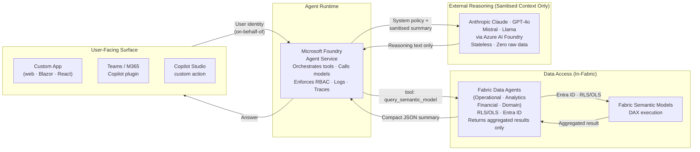
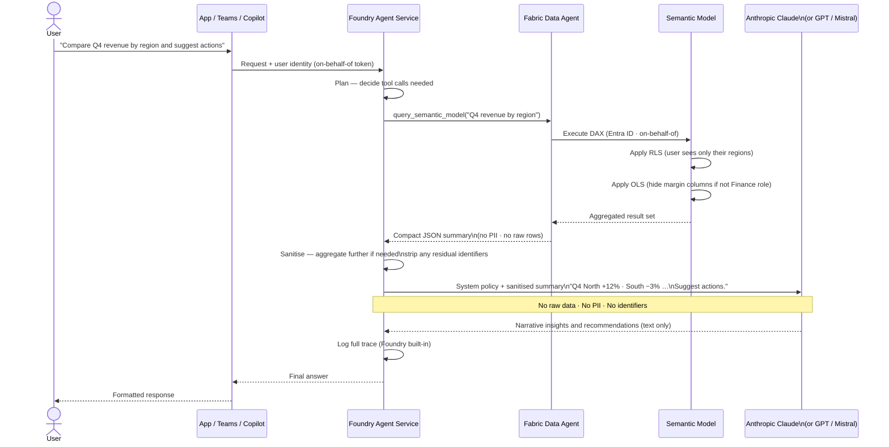

# Foundry Agent Service Architecture

Expose a Foundry agent to users, keep all data access inside Fabric via Data Agents, and use Anthropic or other external models only as a stateless reasoning engine that sees sanitised, minimal context — never raw enterprise data.

---

## Core Building Blocks



!!! info "One Rule for External Models"
    External reasoning models (Claude, GPT, Mistral, etc.) receive **only** a system policy prompt plus a compact, aggregated summary from the Data Agent. They never receive raw row-level data, PII, free-text fields, or direct access to Fabric. They return reasoning text only.

---

## High-Level Request Flow



---

## APIM — Two Optional Positions

APIM is not required for the Foundry Agent architecture to function, but it adds valuable governance controls in two distinct positions. Use one, both, or neither depending on your operational requirements.

=== "Position 1 — Edge Gateway (Before Foundry)"

    **Flow:**
    ```
    User → App / Teams / Copilot Studio → APIM → Foundry Agent → Data Agents → Fabric + Anthropic
    ```

    **When to use:** When users reach the Foundry Agent from multiple channels (web app, Teams bot, Copilot Studio, external partners) and you want a single enforcement point *before any agent work begins*.

    **Advantages:**

    | Advantage | Why it matters |
    |-----------|---------------|
    | **Rate limit before tokens are consumed** | Block quota-exhausted or abusive clients at the edge — Foundry never starts orchestration on a rejected request, saving LLM cost |
    | **Centralised auth token validation** | Validate Entra ID tokens once in APIM; Foundry trusts all inbound requests, eliminating per-channel validation logic |
    | **Single audit log across all channels** | Every user query logged before reaching the agent — Teams bot, web app, and API calls all appear in one Log Analytics stream |
    | **API versioning and blue/green routing** | Route `/v1/agent` → Foundry v1 endpoint; swap to v2 or a new Foundry deployment without touching clients |
    | **IP allowlisting / subscription key enforcement** | Lock down who can call the agent endpoint independent of Foundry's own auth config |

    **APIM policy (Position 1):**

    ```xml
    <policies>
      <inbound>
        <!-- Validate Entra ID token from the user's app -->
        <validate-jwt header-name="Authorization" failed-validation-httpcode="401">
          <openid-config url="https://login.microsoftonline.com/{tenant-id}/.well-known/openid-configuration"/>
          <required-claims>
            <claim name="aud"><value>{foundry-app-client-id}</value></claim>
          </required-claims>
        </validate-jwt>

        <!-- Per-user rate limit: 60 agent calls per minute -->
        <rate-limit-by-key calls="60" renewal-period="60"
          counter-key="@(context.Request.Headers.GetValueOrDefault("Authorization","").GetHashCode().ToString())" />

        <!-- Per-workspace daily quota -->
        <quota-by-key calls="5000" renewal-period="86400"
          counter-key="@(context.Request.Headers.GetValueOrDefault("x-workspace-id","default"))" />

        <!-- Forward to Foundry Agent endpoint using APIM Managed Identity -->
        <authentication-managed-identity resource="{foundry-app-client-id}" />
        <set-backend-service base-url="https://{foundry-project}.{region}.inference.ml.azure.com" />
      </inbound>

      <outbound>
        <!-- Log every user interaction for audit -->
        <log-to-eventhub logger-id="agent-audit-logger">
          @($"workspace={context.Request.Headers["x-workspace-id"]},user={context.Request.Headers.GetValueOrDefault("x-user-id","unknown")},ts={DateTime.UtcNow:o}")
        </log-to-eventhub>
      </outbound>
    </policies>
    ```

=== "Position 2 — Internal Tool Governance (After Foundry)"

    **Flow:**
    ```
    User → Foundry Agent → APIM → Internal APIs / Logic Apps / Data Agent endpoints
    ```

    **When to use:** When the Foundry Agent calls multiple internal tools (Data Agents, Logic Apps, internal search APIs) and you need per-tool governance, rate limiting, and auditing of the *agent's own outbound calls*.

    **Advantages:**

    | Advantage | Why it matters |
    |-----------|---------------|
    | **Per-tool call rate limiting** | Prevent a runaway agent loop from hammering Data Agent endpoints — cap at N calls per session header |
    | **Central audit of every tool call** | Separate log of `query_semantic_model` invocations distinct from the user-level audit; useful for chargeback and debugging |
    | **Backend abstraction** | Swap or version the Data Agent endpoint URL in APIM without changing the Foundry Agent's tool definition |
    | **Response transformation at the gateway** | Enforce max row count, strip inadvertent PII columns *before* the result reaches the Foundry Agent and gets passed to an external model |
    | **Circuit breaker / retry policy** | Protect Fabric Semantic Models from overload when complex agent chains generate many parallel tool calls |

    **APIM policy (Position 2):**

    ```xml
    <policies>
      <inbound>
        <!-- Validate that the caller is the Foundry Agent (Managed Identity) -->
        <validate-jwt header-name="Authorization" failed-validation-httpcode="401">
          <openid-config url="https://login.microsoftonline.com/{tenant-id}/.well-known/openid-configuration"/>
          <required-claims>
            <claim name="appid"><value>{foundry-agent-app-id}</value></claim>
          </required-claims>
        </validate-jwt>

        <!-- Per-session tool call quota: max 20 Data Agent calls per agent run -->
        <quota-by-key calls="20" renewal-period="3600"
          counter-key="@(context.Request.Headers.GetValueOrDefault("x-agent-session-id","default"))" />

        <!-- Route to Fabric Data Agent endpoint -->
        <set-backend-service base-url="https://{fabric-data-agent-endpoint}" />
        <authentication-managed-identity resource="https://analysis.windows.net/powerbi/api" />
      </inbound>

      <outbound>
        <!-- Enforce max 50 rows — strip excess before returning to Foundry Agent -->
        <set-body>@{
          var body = context.Response.Body.As<JObject>(preserveContent: true);
          var rows = body["rows"] as JArray;
          if (rows != null && rows.Count > 50) {
            body["rows"] = new JArray(rows.Take(50));
            body["truncated"] = true;
          }
          return body.ToString();
        }</set-body>

        <!-- Log tool call for per-agent chargeback -->
        <log-to-eventhub logger-id="tool-audit-logger">
          @($"session={context.Request.Headers["x-agent-session-id"]},tool=query_semantic_model,workspace={context.Request.Headers["x-workspace-id"]},ts={DateTime.UtcNow:o}")
        </log-to-eventhub>
      </outbound>
    </policies>
    ```

---

## Agent Tool Design Pattern

Inside Foundry Agent Service, configure your agent with the following tool and policy structure.

### Tool Definitions

```python
tools = [
    {
        "type": "function",
        "function": {
            "name": "query_semantic_model",
            "description": "Query a Fabric Semantic Model via the registered Data Agent. "
                           "Returns an aggregated JSON summary. Never returns raw row-level data.",
            "parameters": {
                "type": "object",
                "properties": {
                    "question": {
                        "type": "string",
                        "description": "Natural-language question about MKC data"
                    },
                    "workspace": {
                        "type": "string",
                        "enum": ["operational", "analytics", "financial", "domain"],
                        "description": "Target Data Agent workspace"
                    }
                },
                "required": ["question", "workspace"]
            }
        }
    },
    {
        "type": "function",
        "function": {
            "name": "run_workflow",
            "description": "Trigger an Azure Logic Apps workflow for operational actions."
        }
    },
    {
        "type": "function",
        "function": {
            "name": "search_docs",
            "description": "Search MKC internal documentation via Azure AI Search (RAG)."
        }
    }
]
```

### System Policy Prompt

```
You are an AI assistant for MKC (Mid-Kansas Cooperative).

TOOLS:
- Use query_semantic_model to retrieve data from Fabric Semantic Models.
- Use run_workflow to trigger operational actions.
- Use search_docs to find internal documentation.

DATA RULES (mandatory):
- You must NEVER expose raw data rows, customer identifiers, or PII in your responses.
- You may ONLY use query_semantic_model to access MKC data — never infer or fabricate numbers.
- Before passing any data to your reasoning, aggregate and summarise it.
- You must NOT memorise or reference data from previous sessions.

RESPONSE RULES:
- Provide insights and recommendations based on the aggregated summaries you receive.
- If you cannot answer without exposing sensitive data, say so and explain why.
- Always cite which workspace group the data came from.
```

### Sanitisation Before Reasoning

The agent tool implementation must sanitise the Data Agent result before it is included in any prompt sent to an external model:

```python
import json
from typing import Any

def sanitise_for_reasoning(data_agent_result: dict[str, Any]) -> str:
    """
    Transform a Data Agent result into a compact, sanitised summary
    safe to include in a prompt to an external reasoning model.
    Never pass raw rows or identifiers to the reasoning model.
    """
    rows = data_agent_result.get("rows", [])
    columns = data_agent_result.get("columns", [])

    # Strip columns that may contain PII or sensitive identifiers
    SAFE_COLUMNS = {"fiscal_period", "region", "division", "commodity_type",
                    "total_revenue", "total_bushels", "margin_pct", "yoy_change_pct"}
    safe_rows = [
        {k: v for k, v in row.items() if k in SAFE_COLUMNS}
        for row in rows[:20]  # cap at 20 rows maximum
    ]

    summary_lines = [f"Data summary ({len(rows)} records, showing top {len(safe_rows)}):"]
    for row in safe_rows:
        summary_lines.append("  " + ", ".join(f"{k}: {v}" for k, v in row.items()))

    return "\n".join(summary_lines)


def call_reasoning_model(question: str, data_summary: str, client) -> str:
    """
    Send sanitised summary + question to the reasoning model.
    The reasoning model receives NO raw data — only the summary.
    """
    prompt = (
        f"Data context (aggregated, no PII):\n{data_summary}\n\n"
        f"User question: {question}\n\n"
        "Provide insights and recommendations based solely on the above summary."
    )
    response = client.complete(
        messages=[
            {"role": "system", "content": SYSTEM_POLICY_PROMPT},
            {"role": "user", "content": prompt}
        ],
        model="claude-3-5-sonnet"  # or gpt-4o — configured in Foundry
    )
    return response.choices[0].message.content
```

---

## Data Leakage Prevention

### 1. Keep Data Access Inside Fabric

- **Data Agents are the only gateway** to Fabric Semantic Models. External reasoning models never call Fabric directly — they only receive what the Foundry Agent explicitly passes.
- Use **Entra ID on-behalf-of flow** for user-delegated access or **service principals with least privilege** for agent-to-Data-Agent calls.
- RLS and OLS in the Semantic Model enforce data boundaries — the Data Agent cannot return data the calling user is not permitted to see.

### 2. Control What Leaves Your Boundary

Before sending any data to an external reasoning model:

- **Aggregate and summarise** — pass totals, trends, and percentages, not row-level records
- **Strip identifiers** — remove `customer_id`, `producer_id`, `employee_id`, names, and any free-text fields that may contain PII
- **Cap result size** — never send more than 20–50 aggregated rows; use prompt templates that say "summarise in 5 bullet points or fewer"
- **Instruct against retention** — include in the system prompt: *"You must not memorise, store, or reference data from this session in future sessions."*

### 3. Provider Data Controls

| Control | Anthropic via Foundry | GPT via Azure OpenAI | Mistral via Foundry |
|---------|----------------------|---------------------|---------------------|
| Zero data retention | Configurable — confirm in DPA | Microsoft DPA (no training on customer prompts) | Confirm per Mistral enterprise terms |
| Independent processor | Yes (Anthropic enterprise) | Yes (Microsoft DPA) | Yes (Azure AI Foundry terms) |
| Prompt audit trail | Foundry built-in logging | Foundry + Azure Monitor | Foundry built-in logging |
| Network path | Azure-native endpoint (Foundry managed) | Azure OpenAI (Private Endpoint optional) | Azure AI Foundry (in-tenant) |

!!! danger "CISO Sign-Off Required Before Production"
    Any external reasoning model that receives prompt text derived from MKC Semantic Model data must be covered by a reviewed Data Protection Addendum **before** production use. For Anthropic, this means the Anthropic Enterprise Agreement including zero data retention terms. Engage the CISO and Legal before onboarding any new provider.

### 4. Network and Identity

```
MKC Users
    ↓ HTTPS (Entra ID token)
[APIM Position 1 — optional]
    ↓ Managed Identity token
Foundry Agent Service (private endpoint recommended)
    ↓ Managed Identity (on-behalf-of / service principal)
[APIM Position 2 — optional]
    ↓ Managed Identity
Fabric Data Agent endpoints (VNet-secured)
    ↓ DAX execution under user identity
Fabric Semantic Models (no public internet)

    ↓ Sanitised summary only (no raw data)
Azure AI Foundry endpoints (controlled egress)
    ↓ HTTPS (Azure-native)
External reasoning model (Anthropic / GPT / Mistral)
```

- Foundry Agent Service and Fabric should sit behind **private endpoints and VNets**
- Use **private DNS** for all internal service resolution
- **No direct Fabric-to-public-internet** egress for data
- Only Foundry's controlled outbound calls to external models — no other component should reach external LLM APIs

---

## User-Facing Surface Options

| Surface | Auth Flow | RLS/OLS Enforcement | APIM Position | Notes |
|---------|-----------|--------------------|-----------|----|
| **Custom app** (React / Blazor) | On-behalf-of (user token → Foundry → Data Agent) | Full — Data Agent sees user identity | Position 1 recommended | Most flexible; full control over UX |
| **Teams / M365 Copilot plugin** | Entra ID SSO via Teams; user identity flows through plugin manifest | Full — same RLS as Power BI in Teams | Position 1 optional | Fastest to deploy for Teams-first organisations |
| **Copilot Studio** | Entra ID (Copilot Studio calls Foundry as a custom action) | Full — Foundry passes user context to Data Agent | Position 1 optional | Low-code conversation; Foundry handles deep reasoning |

---

## References

| Resource | Description |
|----------|-------------|
| [Microsoft Foundry Agent Service overview](https://learn.microsoft.com/en-us/azure/ai-foundry/concepts/agent-service) | Foundry agent orchestration, tool registration, RBAC, and built-in logging |
| [Azure AI Foundry model catalog](https://learn.microsoft.com/en-us/azure/ai-foundry/concepts/foundry-models-overview) | Anthropic, Mistral, Meta, and Cohere models as serverless endpoints |
| [Fabric Data Agent overview](https://learn.microsoft.com/en-us/fabric/data-science/fabric-data-agent) | Natural-language query tool for Fabric Semantic Models — used as a Foundry tool |
| [On-behalf-of flow (Entra ID)](https://learn.microsoft.com/en-us/entra/identity-platform/v2-oauth2-on-behalf-of-flow) | Delegated identity chain: user → app → Foundry Agent → Data Agent |
| [Azure Private Endpoint](https://learn.microsoft.com/en-us/azure/private-link/private-endpoint-overview) | Network isolation for Foundry and Fabric — no public internet traffic |
| [APIM set-backend-service policy](https://learn.microsoft.com/en-us/azure/api-management/set-backend-service-policy) | Routing APIM to Foundry or Data Agent endpoints dynamically |
| [Fabric Data Agents](data-agents.md) | Data Agent workspace mapping, tool call configuration, and RLS enforcement |
| [External Reasoning Models](alternative-llm-providers.md) | Claude, GPT, Mistral as Foundry reasoning backends — sanitisation pattern and data controls |
| [Azure OpenAI Integration](azure-openai-integration.md) | GPT model catalogue and pricing for sizing reasoning backend costs |
| [Cost Scenarios](cost-scenarios.md) | MKC token cost projections for reasoning model selection |
