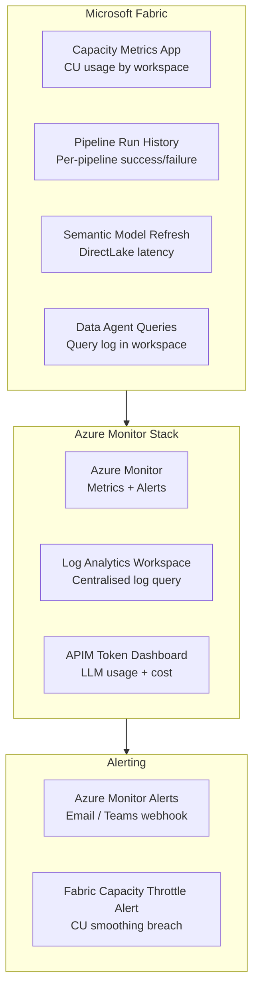

# Observability

## Observability Stack

MKC's platform uses three monitoring layers:



## 1. Fabric Capacity Metrics App

The built-in **Microsoft Fabric Capacity Metrics** app provides the primary CU usage dashboard:

| Metric | Description | Alert Threshold |
|--------|-------------|----------------|
| CU % (15-min avg) | Percentage of capacity used | > 80% sustained → consider upgrade |
| CU smoothing events | Deferred operations due to burst limit | > 5 events/day → optimise Notebooks |
| Top CU consumers | Workspace + item ranked by CU usage | Review top-3 weekly |
| Throttling events | Operations rejected due to CU exhaustion | Any → immediate investigation |

**Install:** Power BI AppSource → search "Microsoft Fabric Capacity Metrics" → Connect to capacity workspace.

## 2. Azure Monitor — Pipeline & Gateway Alerts

Configure Azure Monitor alerts for critical pipeline and gateway events:

```yaml
# Azure Monitor alert rules (Bicep / ARM)
alerts:
  - name: PipelineFailure
    description: Any Fabric pipeline run fails
    condition: "Fabric Pipeline Run Status = Failed"
    severity: 2 (Warning)
    action: email to data-ops@mkcgrain.com + Teams webhook

  - name: GatewayDown
    description: On-Premises Data Gateway heartbeat missing
    condition: "Gateway heartbeat interval > 5 minutes"
    severity: 1 (Critical)
    action: PagerDuty + email

  - name: CapacityThrottle
    description: Fabric capacity CU smoothing exceeded
    condition: "CU Smoothing Overload Events > 10 in 1 hour"
    severity: 2 (Warning)
    action: Teams webhook to data-engineering channel

  - name: SilverFreshness
    description: Silver tables not refreshed within SLA
    condition: "MAX(Silver layer last updated) > 2 hours ago"
    severity: 2 (Warning)
    action: email to data-ops@mkcgrain.com
```

## 3. Log Analytics — Centralised Query Hub

All Fabric, APIM, and Azure service logs flow into a single **Log Analytics Workspace**:

| Log Source | Table | Retention |
|-----------|-------|-----------|
| Fabric audit logs (via Fabric Admin portal) | `FabricAuditLogs` | 90 days |
| Azure APIM access logs | `ApiManagementGatewayLogs` | 90 days |
| On-Prem Gateway logs | `OnsiteDiagnostics` | 30 days |
| Azure Monitor metric alerts | `AlertsManagementResources` | 90 days |
| Key Vault access | `AzureDiagnostics` | 90 days |

### Useful KQL Queries

```kusto
// Pipeline failures in last 24 hours
FabricAuditLogs
| where TimeGenerated > ago(24h)
| where OperationName == "PipelineRun"
| where ResultType == "Failed"
| project TimeGenerated, WorkspaceName, PipelineName, ErrorMessage
| order by TimeGenerated desc

// Top Data Agent token usage by workspace (last 7 days)
ApiManagementGatewayLogs
| where TimeGenerated > ago(7d)
| extend WorkspaceId = tostring(parse_json(RequestBody)["workspace"])
| extend TotalTokens = toint(parse_json(ResponseBody)["usage"]["total_tokens"])
| summarize TotalTokens = sum(TotalTokens), Queries = count() by WorkspaceId, bin(TimeGenerated, 1d)
| order by TotalTokens desc

// Fabric capacity CU consumption by workspace (last hour)
FabricCapacityMetrics
| where TimeGenerated > ago(1h)
| summarize AvgCU = avg(CUUsagePercent) by WorkspaceId, WorkspaceName
| order by AvgCU desc
```

## 4. APIM Token Dashboard

A Power BI report (or Azure Dashboard) connected to Log Analytics shows:

| Widget | Description |
|--------|-------------|
| Token usage by workspace | Bar chart: daily tokens per Data Agent workspace |
| Estimated token cost | Line chart: rolling 30-day AOAI cost ($) |
| Top questions by frequency | Table: most common NL queries by Data Agent |
| Error rate | KPI: failed APIM calls / total calls |
| Latency P95 | KPI: 95th percentile response time (ms) |

## 5. Silver Freshness Dashboard

A lightweight Fabric Notebook runs every 30 minutes and writes freshness metrics to a Gold monitoring table:

```python
# Freshness check notebook — runs every 30 min via Fabric Pipeline
from datetime import datetime, timezone
from pyspark.sql import Row

tables_to_check = [
    ("Silver", "grain_sale_transaction"),
    ("Silver", "dim_customer"),
    ("Gold", "FactGrainSales"),
    ("Gold", "FactGLTransaction"),
]

results = []
for layer, table in tables_to_check:
    max_updated = spark.sql(f"SELECT MAX(updated_at) as t FROM {layer}.{table}").collect()[0]["t"]
    age_minutes = (datetime.now(timezone.utc) - max_updated).total_seconds() / 60
    results.append(Row(layer=layer, table=table, age_minutes=age_minutes,
                       check_time=datetime.now(timezone.utc)))

spark.createDataFrame(results) \
     .write.format("delta").mode("append") \
     .save(gold_monitoring_path + "/table_freshness")
```

An Azure Monitor alert fires if any table exceeds its freshness SLA (Silver: 2 hours, Gold: 3 hours).

---

## References

| Resource | Description |
|----------|-------------|
| [Microsoft Fabric Capacity Metrics app](https://learn.microsoft.com/en-us/fabric/enterprise/metrics-app) | CU usage dashboard by workspace and item type — install from AppSource |
| [Azure Monitor overview](https://learn.microsoft.com/en-us/azure/azure-monitor/overview) | Unified monitoring for metrics, logs, alerts, and dashboards across Azure services |
| [Log Analytics workspace overview](https://learn.microsoft.com/en-us/azure/azure-monitor/logs/log-analytics-workspace-overview) | Centralised log ingestion, KQL querying, and retention configuration |
| [Kusto Query Language (KQL) reference](https://learn.microsoft.com/en-us/azure/data-explorer/kusto/query/) | Full KQL syntax reference for querying Log Analytics tables |
| [Azure Monitor alert rules](https://learn.microsoft.com/en-us/azure/azure-monitor/alerts/alerts-overview) | Creating metric, log, and activity-based alerts with Teams/email notification |
| [APIM monitoring and analytics](https://learn.microsoft.com/en-us/azure/api-management/api-management-howto-use-azure-monitor) | Sending APIM gateway logs to Azure Monitor and Log Analytics |
